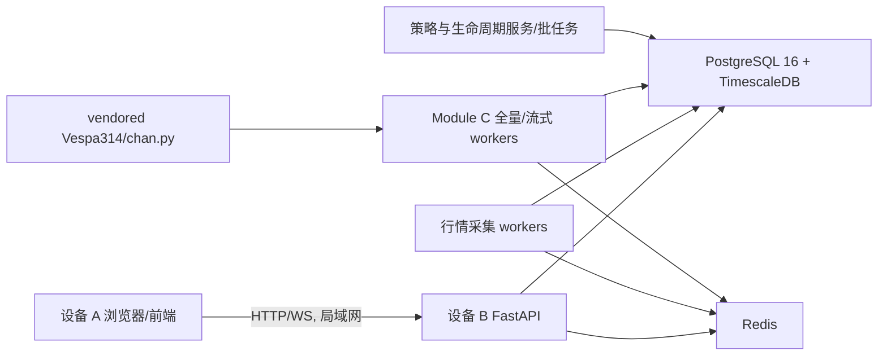

# 后端架构与功能实现状态

## 1. 目标架构

浏览器不能直接读取数据库。即使前后端在同一台电脑，也必须由前端通过 HTTP/WS 请求 API，API 再访问数据库。

## 2. 服务职责

### 2.1 timescaledb

- 保存标的、五级别 K 线、采集水位、Module C 结果、策略生命周期和回测数据。
- `klines` 为 Timescale hypertable。
- Module C 可放独立 tablespace/磁盘卷，但 B 只有一块目标数据盘时可先放同一 PostgreSQL 实例。

### 2.2 redis

- 推送 K 线更新和 Module C published head 更新。
- 不是历史数据真相，不应依赖 Redis 做永久保存。

### 2.3 api

已实现：

- 健康检查、token 鉴权、symbol 搜索、bars。
- v1/v2/v3 图表接口和窗口化 overlay。
- watchlist、问财/LLM 配置和筛选接口。
- `/ws/v1/realtime` K 线实时推送。
- `/ws/v2/chart` 缠论 snapshot/delta/resync 协议。

未收口：

- 旧 bundle 接口仍保留兼容，容易与 v3 主路径混用。
- API 仓储仍保留 5f 聚合 15f/30f/1h/1d 的兜底逻辑；生产要求应优先使用原生周期 K 线，兜底只用于缺数告警或临时兼容。
- 周/月读缓存是新功能，必须先执行迁移 026 和 backfill 脚本。

### 2.4 collector

worker registry 当前包含：

- `market-fill`: 行情补采。
- `history-backfill`: 历史分页补采。
- `symbol-master-refresh`: 标的主数据刷新。
- `tdx-csv-import`: TDX CSV 导入。
- `parquet-bootstrap-import` / audit: 原生 parquet 导入与审计。
- `chan-module-c-recompute`: Module C 全量计算。
- `chan-c-stream`: Module C 尾部增量计算。

未收口：

- Compose 默认只定义 market-fill/history/chan-c-stream/TDX worker，没有把所有 registry worker 都产品化为独立服务。
- 计划中的“8 fetch + 4 stream”尚不是 compose 的默认拓扑。
- `mootdx_provider.py` 已存在，但 collector requirements 未声明 `mootdx`，属于可选实现未完成依赖闭环。

### 2.5 strategy-service

- 当前是独立 Python 批处理/研究服务，没有接 API、后台或前端。
- 包含策略诊断、生命周期账本、事件回放、微回填计划和报告生成。
- Phase 1.21 明确是只读审计，不执行 Phase 1.22 回填。

## 3. 关键数据流

### 3.1 历史初始化

`原始历史文件/供应商 -> 标准化时区和 bar_end -> klines -> 水位/覆盖审计 -> 五级别 Module C 全量重算 -> 原子更新 published heads -> 生命周期回放 -> 策略诊断`

### 3.2 交易时段

`采集最新 bar -> K线 upsert -> ingest watermark -> 标记/发现 stale Module C head -> claim/lease -> 尾部重算 -> CAS 发布 -> Redis 通知 -> API/前端增量更新`

### 3.3 周线/月线

周/月只对“已经结束的上一周/上一月”触发。当前周和当前月的未完成 K 线不应进入 confirmed 结果。代码通过上海时区周初/月初 cutoff 限制高级别 stale-head 发现。

## 4. 当前已知风险

| 风险 | 影响 | B 端动作 |
|---|---|---|
| published head 完整性 | 前端只见尾部或画线中断 | 全量 run 建基线后，对每次增量 run 验证历史前缀+新尾部均存在 |
| 高级别端点投影 | 高级别笔在低周期图错位 | 按高级别 K 覆盖窗口、目标价、同价取最后一根的规则做数据库/接口测试 |
| 周/月缓存未填 | 切周期慢 | 迁移 026 后批量填充并建水位 |
| API 聚合兜底 | 原生与聚合数据混用 | 原生周期缺失时返回明确 warning，不静默替代 Module C 输入 |
| 生命周期不是结构表固有字段 | 历史回测可能未来函数 | 全量重算时同步记录 run/head 历史并生成事件账本 |
| 迁移幂等但含 destructive 027 | 误删旧 B 表 | 新库先 dry-run schema 清单，生产执行前备份 |

## 5. 功能成熟度

- K 线导入/补采：可用，但本轮正在处理重复与缺失，未最终验收。
- Module C 全量五级别：主体可用，collector 测试通过；需在 B 新数据上重跑验收。
- Module C 实时尾部：已实现 claim/lease/CAS/COPY，仍需真实数据库完整性和 5 分钟 SLA 压测。
- 前端窗口化 API：已实现，当前画线/性能问题说明数据发布和端点投影尚未收口。
- 策略生命周期：研究链路已实现，数据覆盖不足，不能称为生产有效策略。
