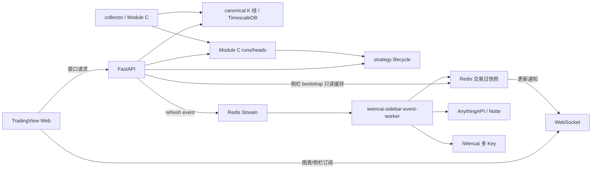

# 设备 B 全项目接管交接说明（2026-07-14）

## 1. 交付定位

本文是设备 B 的当前权威接管入口，覆盖前端、API、行情采集、右侧栏聚合、Module C、策略生命周期和数据库验证。早期 `01` 至 `11` 文档仍可用于追溯，但若与本文冲突，以本文、仓库当前代码和最新用户指令为准。

本次交付分支：`codex/iwencai-sidebar-v2`。

设备 B 的现有后端成果仍保留在独立分支，不应被本分支覆盖：

- `codex/device-b-module-c-lifecycle-execution`，远端已知提交 `5f12465`。
- `codex/device-b-historical-replay-official-backtest-20260714`，计划提交 `7a413d2`。

本次交付是可拉取的代码、测试和交接基线，不代表生产数据已经全部重算，也不授权自动执行历史回放、正式回测或破坏性数据库修复。

## 2. 项目整体目标

项目要形成一套面向 A 股的本地行情与缠论分析系统：

1. 本地 canonical K 线库保存 `5f/30f/1d/1w/1m` 原生周期行情，为图表、Module C 和策略提供统一事实源。
2. TradingView 前端以窗口化方式快速加载 K 线和当前窗口所需的缠论结构，并通过 WebSocket 接收实时增量。
3. collector 内的 Module C 保持 Vespa314 `chan.py` 核心语义，对全市场活跃标的执行五级别独立计算和不可变 run/head 发布。
4. 周线—日线共振二买策略只消费本地已发布 Module C 结果，严格区分 official 和 diagnostic。
5. 右侧栏外部资料采用事件驱动聚合，减少重复请求；本地缠论状态和策略信号不能被外部数据覆盖。
6. 设备 B 负责后端、数据库、Module C、策略生命周期和全量任务；设备 A 可继续承担前端交互与验收，但两端通过 Git 合同协作。

## 3. 不可破坏的技术合同

### 3.1 Module C

- 唯一权威路径是 collector-owned Module C，禁止恢复 Module B、namespace-B、`CHAN_SERVICE_URL` 或运行时 fallback。
- 当前计算合同为 `native-5lvl-v4-bi-strict-false-bi-allow-sub-peak-false`。
- `5f/30f/1d/1w/1m` 必须分别读取对应原生周期 K 线，不能用 5 分钟结果递归替代高级别计算。
- `bi_strict=false`，`bi_allow_sub_peak=false`；不允许次高点或次低点成笔。
- 不修改 vendored `chan.py`。适配、窗口化、发布和端点映射行为放在外围 adapter/API 中。
- 每次发布必须保留完整有效历史前缀；尾部增量 run 不能作为残缺全量 head 对外发布。
- 保留不可变 run/head、稳定 identity、事件时间、确认时间和无未来函数语义。

### 3.2 策略

- 官方路径为 `weekly_daily_b2_resonance_v1`。
- official、diagnostic、relaxed research 必须物理和逻辑隔离。
- diagnostic 结果不能冒充正式回测，也不能进入 official 输出。
- 历史回放必须基于可见性时间和事件账本，不能用当前 head 倒推过去可见状态。

### 3.3 数据所有权

| 数据域 | 权威来源 | 允许用途 | 禁止事项 |
| --- | --- | --- | --- |
| 主图、历史、实时 K 线 | 本地 canonical K 线库 | 图表、Module C、策略 | 外部行情覆盖 canonical K 线 |
| 笔、线段、中枢、买卖点、发布 head | 本地 Module C 数据库 | 图表覆盖、选股、策略 | 外部源生成或补写 |
| 策略信号与生命周期 | 本地 strategy 数据库 | official/diagnostic 分层消费 | 新闻或外部行情改写信号 |
| 关注列表成员、分组、排序 | 本地用户设置 | 前端关注列表 | 外部源替代用户资产 |
| 关注行报价、资料、估值、资金、行业概念、市场强度、新闻 | iWencai/AnythingAPI 归一化快照 | 右侧栏展示 | 从本地 K 线伪造缺失字段 |

## 4. 当前功能架构



### 4.1 图表链路

- HTTP：`GET /api/v3/chart/window` 返回窗口化 K 线和覆盖层。
- WebSocket：`/ws/v2/chart` 处理窗口请求、实时订阅和重连恢复。
- `chartDataManager` 合并重叠请求、取消旧 symbol/epoch 请求、限制缓存规模并拒绝旧响应回写。
- 拖拽历史时按缺口向前加载，不再固定预取完整历史。
- Chan 覆盖窗口按当前图表周期请求：

| 当前图表 | 返回级别 |
| --- | --- |
| 5f / 15f | 5f + 30f + 1d |
| 30f / 1h | 30f + 1d |
| 1d | 1d + 1w |
| 1w | 1w + 1m |
| 1m | 1m |

- 高级别端点投影到低级别图时，在高级别 K 覆盖时间内按目标极值定位；同价多根取最后一根。

### 4.2 右侧栏链路

- 前端确认主图 symbol 后，使用 `chart_symbol + chart_epoch` 和 `watchlist_id + watchlist_revision` 建立上下文。
- `POST /api/v3/market/sidebar/bootstrap` 只读 Redis/数据库快照，不同步等待外部源。
- API 将 cache miss 作为 `sidebar_refresh_requested` 写入 Redis Stream。
- `iwencai-sidebar-event-worker` 仅消费事件，不轮询；同一交易日、域、symbol 使用缓存和 single-flight。
- 默认 provider 顺序为 `notte,iwencai`。Notte/AnythingAPI 不可用时才回退 iWencai；无 Notte key 时直接使用 iWencai。
- iWencai 支持单 key 环境变量和数据库运行时多 key 配置；认证失败、限额或不可用时由 adapter 轮换有效 key。
- 外部域包括 `quote/profile/valuation/capital_flow/themes/strength/news`。
- Chan/strategy 投影始终从本地数据库读取，source 为 `local_db`。
- freshness 只有 `fresh/stale/unavailable`；缺失字段保持空，不用本地 bar、mock 或占位数字伪造。
- WebSocket delta 使用 epoch、revision、sequence 和 snapshot version 防止 A→B→A、乱序或重连旧包污染当前界面。

### 4.3 运行时配置

模板只保留占位符，真实凭据不得提交：

```dotenv
IWENCAI_BASE_URL=https://openapi.iwencai.com
IWENCAI_API_KEY=
IWENCAI_ALLOWED_HOSTS=openapi.iwencai.com
IWENCAI_TIMEOUT_SECONDS=5
MARKET_DATA_PROVIDER_ORDER=notte,iwencai
NOTTE_API_KEY=
NOTTE_FUNCTION_ID=e4157137-02c9-4052-85c0-9ee5c2c91682
NOTTE_TIMEOUT_SECONDS=45
```

多 key 由后台 `wencai.config` 运行时配置提供，包含 `api_keys[]`、enabled、priority、base URL 和超时。任何日志、响应、fixture 或文档都不得包含真实 key、cookie 或 Authorization。

## 5. 本次已完成开发

### 5.1 右侧栏 V2

- 删除 WeStock CLI、Node bridge、本地 quote fallback 和相关 Docker 依赖。
- 新增 iWencai 严格 adapter、八类脱敏 fixture 和异常响应测试。
- 新增 AnythingAPI/Notte adapter，并作为可配置首选 provider。
- 新增交易日缓存、Redis lease、进程内 single-flight 和事件 worker。
- API bootstrap 改为 cache-only；外部填充异步完成并通过 WebSocket 通知。
- 完成 iWencai 多 key 管理、测试连接、保存和 worker 配置热加载。
- 关注列表和资料卡外部字段统一走归一化快照；Chan/strategy 保持本地来源。
- 空字段不展示；新闻采用标题、时间、来源、相关标的和链接的紧凑布局。
- 市场主题改为双列卡片，涨幅与主题名同一行，资金流在第二行。
- 缠论状态文案已中文化。

### 5.2 图表性能与覆盖层

- 图表历史改为窗口化、重叠请求合并、旧请求 abort 和 epoch fence。
- 支持共享 WebSocket、断线重连和 bounded resync。
- Chan 覆盖按可视窗口和周期级别组合加载，避免完整 bundle。
- 端点投影、同价取最后一根、日/周/月上海时区边界均有前端合同测试。

### 5.3 部署

- Compose profile 新增 `sidebar-iwencai`，服务名 `iwencai-sidebar-event-worker`。
- 默认 `COMPOSE_PROFILES=realtime-pipeline,sidebar-iwencai`。
- worker 通过 Redis Stream 消费事件，异常消息保留 pending，可 replay/claim，不使用固定周期外呼。
- `.env.example` 和 `deploy/backend.env.example` 仅保留安全占位符。

## 6. 本次验证证据

在提交前于 2026-07-14 使用当前工作树执行：

```powershell
cd apps/web
H:\node\npm.cmd run test:contract
# 102 passed, 0 failed

H:\node\npm.cmd run build
# TypeScript + Vite production build passed

cd services/api
$env:PYTHONPATH='.'
C:\Users\yangyang\.cache\codex-runtimes\codex-primary-runtime\dependencies\python\python.exe -m pytest tests -q
# 162 passed, 8 skipped

cd services/collector
$env:PYTHONPATH='.'
C:\Users\yangyang\.cache\codex-runtimes\codex-primary-runtime\dependencies\python\python.exe -m pytest tests -q
# 219 passed
```

运行态同时确认：TimescaleDB、Redis、API、web gateway 和 `iwencai-sidebar-event-worker` 容器可启动。上述单元/合同测试通过不等于设备 B 的生产数据库和全市场重算已验收。

## 7. 当前已知缺口与风险

### 7.1 必须阻塞发布的问题

1. **设备 B 的 current-v4 Module C 全量 head 仍需独立核验。** 设备 A 曾出现 G 盘恢复后 current v4 head 为空、旧 v3 兼容 head 存在的情况，导致图表覆盖为空。设备 B 不能把旧 v3 结果当作 v4 验收。
2. **完整历史前缀必须验证。** 已知旧问题是 published head 指向只含尾部数据的增量 run，表现为笔、线段、中枢和买卖点缺失或混乱。
3. **历史生命周期数据仍不足以正式回测。** 当前设备 B 已完成全量 disposition 与生命周期对账，但 official historical coverage 仍缺失。
4. **外部数据源字段不是全量保证。** AnythingAPI/iWencai 返回缺失时当前约定是不展示；不能用推测值补齐。

### 7.2 性能待验证

- 设备 A 曾测到缓存命中 K 线约几十毫秒，但冷启动日线查询可达十秒级；设备 B 必须测冷/热 p50、p95、p99。
- 侧栏缓存命中应为毫秒级；首次外部填充允许异步，但 bootstrap 不得阻塞等待外部源。
- 需要在真实拖拽、快速切 symbol、快速切周期和 WebSocket 断网重连下做浏览器验收。

### 7.3 数据与磁盘

- 不迁移设备 A 的 PostgreSQL data directory、tablespace、WAL 或 Docker volume。
- G 盘 Module C tablespace 必须在容器启动前正确挂载并检查 relation/index 文件。
- 任何 canonical K 线修复必须先 dry-run、保留冲突证据，不删除唯一有效 bar。

## 8. 设备 B 接管步骤

### 8.1 拉取本分支

在设备 B 的干净工作树中执行：

```powershell
git status --short
git fetch origin --prune
git switch codex/iwencai-sidebar-v2
git pull --ff-only origin codex/iwencai-sidebar-v2
git log -5 --oneline
```

如果设备 B 尚无本地分支：

```powershell
git switch --track -c codex/iwencai-sidebar-v2 origin/codex/iwencai-sidebar-v2
```

不要直接在该交付分支继续大型开发。应从它创建新的设备 B 集成分支，并将设备 B 已有 Module C 分支通过 review 后合并或 cherry-pick。禁止 `reset --hard`、`clean -fd` 或强推覆盖设备 B 现有工作。

### 8.2 配置与启动

```powershell
Copy-Item deploy/backend.env.example deploy/backend.env
# 在本地 backend.env 或后台运行时配置中填写真实密钥；不要提交该文件。

docker compose --env-file deploy/backend.env `
  -f deploy/docker-compose.backend.yml `
  up -d --build timescaledb redis db-migrate api web-gateway iwencai-sidebar-event-worker
```

启动后检查：

```powershell
docker compose --env-file deploy/backend.env -f deploy/docker-compose.backend.yml ps
docker logs --tail 200 tv_backend_api
docker logs --tail 200 tv_backend_iwencai_sidebar_event_worker
```

不得在 health check、WebSocket heartbeat 或前端 timer 中触发 iWencai/Notte 外呼。

### 8.3 复验代码

设备 B 必须原样执行第 6 节四条验证命令，并记录本机结果。失败时先定位环境差异，不得跳过合同测试后直接跑生产数据任务。

## 9. 后续开发与验证计划

### 阶段 A：分支整合与合同回归

目标：把本次前端/侧栏分支与设备 B Module C 分支整合到新的 review 分支。

验收：

- 变更不恢复 Model B、WeStock、本地 quote fallback 或 `chan-service`。
- `chan.py` 无改动。
- web 102、API 162、collector 219 测试至少保持通过；skip 原因有记录。
- Compose 配置解析通过，真实密钥不进入 Git。

### 阶段 B：K 线与 Module C 数据真相验收

目标：确认所有活跃标的五级别输入唯一、规范，并生成 current v4 完整历史发布结果。

验收：

- 每个 `(symbol_id,timeframe,ts)` 唯一；无 start-time 伪装成 end-time 的 09:30/13:00 bar。
- 只处理 `symbols.is_active=true`；不导入退市/非活跃标的。
- current v4 confirmed/predictive head 按 `5f/30f/1d/1w/1m` 覆盖目标活跃标的。
- 每个 published run 的最早/最晚结构时间和数量证明其包含完整有效历史前缀。
- 抽样对比笔端点、线段、中枢、signals；次高/次低不成笔。
- 无 MemoryError、Postgres I/O error、relation file 缺失或 G 盘低水位风险。

### 阶段 C：图表端到端验收

目标：验证窗口化 K 线、Chan 覆盖和实时重同步。

场景：`000001.SZ`、沪市、深市、科创板、北交所、停牌稀疏和跳空样本；分别测试 5f/30f/1d/1w/1m。

验收：

- 切 symbol 热缓存 p95 小于 1 秒；冷缓存 p95 小于 3 秒，若数据库冷查询超标必须附 EXPLAIN ANALYZE。
- 周期切换和向左拖拽首屏 p95 小于 1.5 秒。
- 同一窗口不重复请求；A→B→A 不显示旧 A 响应。
- 断网后恢复只做一次 bounded resync，无重复线、断线或旧 sequence 覆盖。
- 笔端点落在正确 K 线极值；同价多根取最后一根；中心区间和买卖点与数据库一致。

### 阶段 D：侧栏端到端验收

目标：验证事件驱动、交易日缓存、多 key 和 fallback。

验收：

- cache-hit bootstrap p95 小于 150 ms，cache-miss bootstrap p95 小于 300 ms 且不等外部源。
- 同一交易日同一 domain/symbol 并发 100 个请求只产生一次外呼。
- 无 UI 事件运行 30 分钟，外部请求计数保持 0。
- iWencai key 401/403/429 时自动切换；所有 key 失败后显示 stale/unavailable。
- Notte 失败后回退 iWencai；两者失败不影响 K 线、Chan 和 strategy。
- 切主图 symbol 后资料卡和新闻跟随主图，不与关注列表选中状态错误绑定。
- 所有可见文案为中文；空域不展示假数据。

### 阶段 E：历史生命周期与正式回测门

详细计划位于远端分支 `codex/device-b-historical-replay-official-backtest-20260714` 的提交 `7a413d2`，文件为 `docs/plans/2026-07-14-device-b-historical-replay-official-backtest.md`。

执行前置门：阶段 B 完成，历史 snapshot/event ledger 可证明 first-seen/confirm-time，无未来数据泄漏。

验收：

- official historical coverage 不再为 0，且覆盖口径可复现。
- official 和 diagnostic 输出目录、manifest、计数、报告相互隔离。
- event replay 只读取当时可见事件。
- 正式回测必须给出样本数、waterfall、交易成本、收益/回撤/胜率及失败样本；不满足覆盖门则明确 NO-GO，不包装为正式结果。

## 10. 设备 B 回报模板

```text
接管分支与 HEAD：
设备 B 集成分支：
合并/cherry-pick 的设备 B 提交：
web/API/collector 测试结果：
Docker 服务状态：
canonical K 线覆盖与重复数：
current v4 各 level/mode head 数：
完整历史前缀抽检结果：
图表冷/热 p50/p95/p99：
侧栏 bootstrap 与外部填充 p50/p95/p99：
iWencai 多 key 与 Notte fallback 测试：
历史生命周期 official coverage：
执行过的数据库写操作：
未提交文件：
阻塞项与需要用户决策的问题：
```

## 11. 安全与回滚

- 不提交 `.env`、真实 key、cookie、token、数据库、WAL、tablespace、缓存、日志或 TradingView 授权资产。
- 外部 provider 故障时回滚到最近成功快照或 unavailable，不回退到 WeStock/本地推导值。
- 前端/API 合同异常时可以关闭外部侧栏功能，但不得影响 canonical K 线、Module C 和策略数据库。
- 数据库写操作必须有 run id、checkpoint、失败清单和可重复 dry-run；禁止静默跳过冲突。
- 推送代码不等于授权执行生产全量任务。
