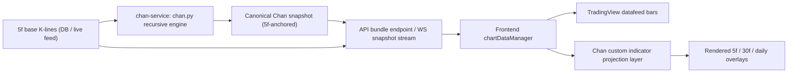

# Chan Overlay Refactor V2 Implementation Plan

> **For Claude:** REQUIRED SUB-SKILL: Use superpowers:executing-plans to implement this plan task-by-task.

**Goal:** Rebuild the Chan calculation-to-render pipeline so that all three Chan levels are computed from the 5f base series, serialized with canonical 5f endpoint identities, and projected onto any TradingView chart timeframe without endpoint drift, broken continuity, or incorrect center connections.

**Architecture:** Keep `Vespa314/chan.py` as the only Chan engine. Move the contract boundary so the backend emits a canonical three-level overlay bundle anchored to 5f base bars, and the frontend PineJS-like study only performs view projection, not structural inference. Reuse the old scheme’s proven frontend lookup/projection logic and center-break behavior, but refit it to the current React/Vite codebase and current API service layout.

**Tech Stack:** Python 3.11, FastAPI, TimescaleDB/PostgreSQL, Redis, TradingView Advanced Charts, PineJS-like custom indicator, TypeScript/React/Vite.

---

# System: A Share Chan Overlay V2

## Requirements

### Functional
- All Chan structures are computed from the 5f base series.
- 30f and daily Chan levels are derived recursively from the low-level Chan structure, not from independently aggregated 30f/1d K-lines.
- Any frontend chart timeframe request returns the same three-level Chan overlay dataset for the same symbol snapshot.
- Frontend chart timeframe only acts as a display lens; it must not change Chan calculation semantics.
- 5f/30f/daily strokes, segments, centers, and buy/sell points must remain bound to the correct K-lines when displayed on higher or lower chart timeframes.
- Centers must not visually connect across separate ranges.
- Buy/sell points must support visibility rules:
  - chart timeframe >= 1d: show daily + 30f buy/sell points
  - chart timeframe < 1d: show daily + 30f + 5f buy/sell points
- Watchlist symbol profile must show current stroke direction for the three Chan levels:
  - daily stroke status
  - 30f stroke status
  - 5f stroke status
- Watchlist symbol profile must surface one borrowed `waditu/czsc` signal function:
  - `cxt_intraday_V230701`
  - displayed as the current trading day's intraday classification
  - computed from the current trading day's available 30f bars; if the current day has insufficient bars to classify, return `其他` and do not fall back to the previous trading day

### Non-Functional
- Snapshot consistency: one chart load must use one coherent `bars + chan` version for a symbol.
- Deterministic rendering: same input bars must produce the same overlay payload and same plotted endpoints.
- Concurrency model: per-symbol analysis state must not be shared mutably across request threads.
- Debuggability: every plotted endpoint must be traceable back to a canonical 5f base bar identity.
- Migration speed: prioritize direct reuse of the old scheme’s stable projection logic over greenfield redesign.

### Constraints
- Current repo must remain the execution target:
  - `C:\Users\yangyang\Documents\Codex\2026-06-13\tradingview-tradingview-a-5f-15f-30f`
- Current frontend must stay TradingView-based:
  - `C:\Users\yangyang\Documents\Codex\2026-06-13\tradingview-tradingview-a-5f-15f-30f\apps\web\src`
- Current backend service split must stay:
  - API service under `services\api`
  - Chan service under `services\chan-service`
- Old scheme is the reference implementation for projection/rendering behavior:
  - `C:\Users\yangyang\Documents\Codex\2026-06-13\tradingview-tradingview-a-5f-15f-30f\旧版方案`

## High-Level Architecture



## Core Design

### 1. Canonical timeline
- The only canonical overlay identity is the 5f base bar.
- Every endpoint must carry:
  - `base_ts`
  - optional `base_seq`
  - `price`
  - `level`
  - `confirmed/predictive`
- Frontend projection must map these 5f endpoint identities onto the currently displayed chart timeframe.

### 2. Calculation semantics
- `chan.py` remains the calculation engine.
- `vendor_chan_adapter.py` must stop serializing display-oriented timestamps from non-5f bars.
- The adapter must emit all three levels in one bundle, but every structure endpoint must be expressed in 5f base-bar terms.

### 3. Rendering semantics
- Frontend custom indicator remains the renderer.
- It must not:
  - infer promoted segments
  - dedupe coincident low/high level endpoints
  - repair or re-chain backend structure
- It may only:
  - project canonical 5f-bound objects into the current chart timeframe
  - apply visibility rules
  - break connections across centers or predictive/confirmed transitions

### 4. Center rendering
- Centers are rendered as filled ranges or boxes only.
- Upper/lower center rail plots must never be the primary visible artifact.
- Projection must inject explicit `NaN` breaks between adjacent centers.

### 5. Read/write concurrency
- One mutable analysis context per symbol.
- Published result is an immutable snapshot object keyed by `symbol + snapshot_version`.
- Requests and websocket subscribers only read immutable snapshots.

### 6. Watchlist intelligence
- The symbol profile card is allowed to consume the same immutable Chan snapshot contract as the chart.
- Current stroke state is derived from the latest per-level stroke in snapshot order, preferring in-progress/predictive stroke when present, otherwise the latest confirmed stroke.
- `CZSC` signal integration must not be hard-coded into the profile layout; it must enter through a dedicated signal adapter so additional signal functions can be added without reshaping the card.

---

# ADR-0009: Use 5f Canonical Endpoint Identity

## Status
Proposed

## Context
The current overlay path mixes display timeframe timestamps with analysis-level timestamps. That creates endpoint drift, missing/highly ambiguous endpoint placement, and incorrect structure continuity on 30f/daily charts.

## Decision
Anchor every Chan object endpoint to the 5f base series and treat chart timeframe as a projection lens only.

## Consequences

### Positive
- One unambiguous source of truth for endpoint placement.
- Daily and 30f structures can be plotted on any chart timeframe without re-running Chan logic in the browser.
- Regression testing becomes data-driven.

### Negative
- Backend adapter and persistence schema must change.
- Frontend study becomes projection-heavy and must maintain more lookup tables.

### Alternatives Considered
- Keep per-timeframe overlay timestamps: rejected because this is the current failure mode.
- Compute separate overlays per chart timeframe: rejected because it breaks the “same Chan, different lens” requirement.

---

# ADR-0010: Keep chan.py as the Only Chan Engine

## Status
Proposed

## Context
The user requirement is explicit: higher-level Chan structure must derive from low-level structure, not from directly aggregated higher-timeframe K-lines.

## Decision
Retain `Vespa314/chan.py` as the only Chan engine and use external projects only for implementation ideas, not as the primary semantic engine.

## Consequences

### Positive
- Preserves required Chan semantics.
- Avoids mixing incompatible multi-period models.

### Negative
- We do not gain native-code acceleration immediately.
- We must harden our own serialization and snapshot pipeline.

### Alternatives Considered
- `YuYuKunKun/chanlun.py`: rejected as primary engine because its multi-period model is closer to “aggregate high-period bars and analyze per period”.
- `YuYuKunKun/chanlun.c99`: rejected as primary engine for the same semantic reason, though its concurrency/performance patterns are worth borrowing.

---

# ADR-0011: Reuse Old-Scheme Projection Logic Instead of Re-Inventing It

## Status
Proposed

## Context
The old scheme already contains a working projection layer for:
- `buildLookupTablesFromWS`
- `buildStrokePointsForView`
- `buildBspMapForView`
- `sortedPivotsForView`
- `lastPointInRange`
- `findPivotOverlap`
- `applyPivotBreak`

## Decision
Port those mechanics into the current TypeScript `chanStudy.ts`, but feed them with the new canonical backend contract instead of the old ad hoc payloads.

## Consequences

### Positive
- Fastest path to a known-good rendering model.
- Limits exploratory frontend debugging.

### Negative
- Requires disciplined porting, not selective copy/paste.
- Existing current-study logic will likely be deleted rather than incrementally patched.

---

## Target Contract

### Backend overlay snapshot shape

```json
{
  "symbol": "000001.SZ",
  "snapshot_version": "2026-06-22T10:30:00Z#12345",
  "base_timeframe": "5f",
  "base_ts_semantics": "bar_end",
  "levels": {
    "5f": {
      "strokes": [
        {
          "id": "5f-bi-001",
          "begin_base_ts": "2026-06-03T13:30:00+08:00",
          "end_base_ts": "2026-06-04T14:30:00+08:00",
          "begin_price": 10.63,
          "end_price": 11.10,
          "is_sure": true
        }
      ],
      "segments": [],
      "centers": [],
      "signals": []
    },
    "30f": { "... same shape ..." : "..." },
    "1d": { "... same shape ..." : "..." }
  }
}
```

### Frontend projection contract
- Input:
  - one visible chart timeframe bar series
  - one immutable three-level overlay snapshot
- Output:
  - per-level point maps keyed by visible chart bars
  - per-level center fill ranges
  - per-level buy/sell point placements

---

## Migration Strategy

### What is reused from the old scheme
- `旧版方案\frontend\chan-study.js`
- `旧版方案\frontend\ws-data-manager.js`
- `旧版方案\backend\chan_engine\analyzer.py`
- `旧版方案\backend\stream_transport.py`

### What is not reused as-is
- Old standalone HTML shell:
  - `旧版方案\frontend\index-ws.html`
- Old frontend runtime wrappers that do not match current React structure
- Old backend websocket server layout outside current FastAPI app structure

### What is deleted or replaced in the current scheme
- Current TypeScript study logic that does endpoint repair or promoted-segment filtering:
  - `apps\web\src\tradingview\chanStudy.ts`
- Current display-timestamp-oriented adapter serialization:
  - `services\chan-service\chan_service\vendor_chan_adapter.py`

---

### Task 1: Freeze the new overlay contract and reference windows

**Files:**
- Create: `C:\Users\yangyang\Documents\Codex\2026-06-13\tradingview-tradingview-a-5f-15f-30f\docs\adr\0009-use-5f-canonical-endpoint-identity.md`
- Create: `C:\Users\yangyang\Documents\Codex\2026-06-13\tradingview-tradingview-a-5f-15f-30f\docs\adr\0010-keep-chan-py-as-only-engine.md`
- Create: `C:\Users\yangyang\Documents\Codex\2026-06-13\tradingview-tradingview-a-5f-15f-30f\docs\adr\0011-reuse-old-scheme-projection-logic.md`
- Create: `C:\Users\yangyang\Documents\Codex\2026-06-13\tradingview-tradingview-a-5f-15f-30f\services\chan-service\tests\fixtures\chan_regression_windows.json`
- Modify: `C:\Users\yangyang\Documents\Codex\2026-06-13\tradingview-tradingview-a-5f-15f-30f\docs\plans\2026-06-22-chan-refactor-v2.md`

**Intent**
- Freeze the exact behavior before coding.

### Task 1A: Add watchlist Chan intelligence contract

**Files:**
- Modify: `C:\Users\yangyang\Documents\Codex\2026-06-13\tradingview-tradingview-a-5f-15f-30f\apps\web\src\api\marketData.ts`
- Modify: `C:\Users\yangyang\Documents\Codex\2026-06-13\tradingview-tradingview-a-5f-15f-30f\apps\web\src\components\WatchlistPanel.tsx`
- Modify: `C:\Users\yangyang\Documents\Codex\2026-06-13\tradingview-tradingview-a-5f-15f-30f\apps\web\src\styles.css`

**Intent**
- Surface three-level current stroke state in the watchlist profile card without waiting for backend route expansion.
- Add `cxt_intraday_V230701` as the first `CZSC` signal in the watchlist card and keep the adapter extensible for additional signals.

**Verify**
- Selecting a symbol in the watchlist shows `日线笔 / 30f笔 / 5f笔` current direction state.
- The profile card includes a dedicated `策略信号` area and shows the current trading day's `cxt_intraday_V230701` classification; if the current day is not yet classifiable, it returns `其他`.
- Record the known-bad windows the user identified.

**Reference windows to include**
- 30f:
  - `2026-06-08 11:00 -> 2026-06-09 10:00`
  - `2026-06-09 11:00 -> 2026-06-10 10:00`
  - `2026-06-10 10:00 -> 2026-06-11 10:00`
- 5f:
  - `2026-05-15 10:00 -> 2026-05-18 14:30`
  - `2026-05-22 10:00 -> 2026-05-26 10:00`
  - `2026-05-27 10:00 -> 2026-05-28 14:30`
- 1d center non-connection regression:
  - user-provided 1d screenshot window around separate centers

**Verify**
- Regression fixture file exists and names expected endpoints explicitly.
- ADRs document the design decisions before implementation.

---

### Task 2: Introduce canonical 5f-bound backend models

**Files:**
- Modify: `C:\Users\yangyang\Documents\Codex\2026-06-13\tradingview-tradingview-a-5f-15f-30f\services\chan-service\chan_service\models.py`
- Modify: `C:\Users\yangyang\Documents\Codex\2026-06-13\tradingview-tradingview-a-5f-15f-30f\services\chan-service\chan_service\vendor_chan_adapter.py`
- Modify: `C:\Users\yangyang\Documents\Codex\2026-06-13\tradingview-tradingview-a-5f-15f-30f\services\chan-service\chan_service\analyzer.py`
- Test: `C:\Users\yangyang\Documents\Codex\2026-06-13\tradingview-tradingview-a-5f-15f-30f\services\chan-service\tests\test_analyzer.py`

**Intent**
- Replace output timestamps based on display timeframe or higher-level object timestamps.
- Emit a three-level bundle where every endpoint is rooted in 5f base bar identity.

**Implementation notes**
- Reuse old conversion strategy from:
  - `旧版方案\backend\chan_engine\analyzer.py`
- But enforce:
  - all `begin/end/signal/center` objects expose `begin_base_ts/end_base_ts`
  - no serialization of chart-timeframe-specific timestamps
  - no frontend-only promoted/dedupe hints

**Verify**
- Unit tests assert:
  - three levels are always returned together
  - endpoint fields are 5f-bound
  - known regression windows produce alternating stroke direction and expected endpoints

---

### Task 3: Persist canonical endpoint fields and snapshot versioning

**Files:**
- Create: `C:\Users\yangyang\Documents\Codex\2026-06-13\tradingview-tradingview-a-5f-15f-30f\db\sql\009_chan_canonical_projection.sql`
- Modify: `C:\Users\yangyang\Documents\Codex\2026-06-13\tradingview-tradingview-a-5f-15f-30f\services\api\app\repositories\chan_postgres.py`
- Modify: `C:\Users\yangyang\Documents\Codex\2026-06-13\tradingview-tradingview-a-5f-15f-30f\services\api\app\models.py`
- Test: `C:\Users\yangyang\Documents\Codex\2026-06-13\tradingview-tradingview-a-5f-15f-30f\services\api\tests\test_chan_postgres.py`

**Intent**
- Make stored Chan results projection-safe and versioned.

**Schema direction**
- Add canonical endpoint columns for strokes, segments, centers, signals:
  - `begin_base_ts`
  - `end_base_ts`
  - optional `begin_base_seq`
  - optional `end_base_seq`
- Add `snapshot_version` / `computed_at` to `chan_runs`

**Verify**
- Repository tests confirm round-trip read/write of canonical endpoint fields.
- Same `snapshot_version` is returned across all three levels for one request.

---

### Task 4: Unify the API into one chart bundle and one WS snapshot path

**Files:**
- Modify: `C:\Users\yangyang\Documents\Codex\2026-06-13\tradingview-tradingview-a-5f-15f-30f\services\api\app\routes\chart.py`
- Modify: `C:\Users\yangyang\Documents\Codex\2026-06-13\tradingview-tradingview-a-5f-15f-30f\services\api\app\routes\chan.py`
- Modify: `C:\Users\yangyang\Documents\Codex\2026-06-13\tradingview-tradingview-a-5f-15f-30f\services\api\app\routes\chart_ws.py`
- Modify: `C:\Users\yangyang\Documents\Codex\2026-06-13\tradingview-tradingview-a-5f-15f-30f\services\api\app\services\chan_client.py`
- Test: `C:\Users\yangyang\Documents\Codex\2026-06-13\tradingview-tradingview-a-5f-15f-30f\services\api\tests\test_api.py`
- Test: `C:\Users\yangyang\Documents\Codex\2026-06-13\tradingview-tradingview-a-5f-15f-30f\services\api\tests\test_realtime.py`

**Intent**
- Stop treating bars and Chan as independently drifting reads.
- Expose one chart bundle load path and one websocket snapshot/update path.

**Direction**
- HTTP:
  - `GET /api/v2/chart/bundle?symbol=...&timeframe=...&from=...&to=...`
  - returns bars for current timeframe + one canonical three-level overlay snapshot
- WS:
  - `chan_snapshot`
  - `chan_delta`
  - both carry the same canonical fields and `snapshot_version`

**Verify**
- API tests assert one request returns bars + all three Chan levels.
- Realtime tests assert `snapshot_version` monotonicity and event shape stability.

---

### Task 5: Port the old projection core into the current TypeScript study

**Files:**
- Modify: `C:\Users\yangyang\Documents\Codex\2026-06-13\tradingview-tradingview-a-5f-15f-30f\apps\web\src\tradingview\chanStudy.ts`
- Modify: `C:\Users\yangyang\Documents\Codex\2026-06-13\tradingview-tradingview-a-5f-15f-30f\apps\web\src\tradingview\chanStudySettings.ts`
- Modify: `C:\Users\yangyang\Documents\Codex\2026-06-13\tradingview-tradingview-a-5f-15f-30f\apps\web\src\tradingview\overlaySettings.ts`
- Reference:
  - `C:\Users\yangyang\Documents\Codex\2026-06-13\tradingview-tradingview-a-5f-15f-30f\旧版方案\frontend\chan-study.js`

**Intent**
- Replace the current drift-prone study with the old scheme’s proven lookup/projection model.

**Functions to transplant semantically**
- `buildLookupTablesFromWS`
- `buildStrokePointsForView`
- `buildBspMapForView`
- `sortedPivotsForView`
- `lastPointInRange`
- `findPivotOverlap`
- `applyPivotBreak`

**Rules**
- No promoted segment dedupe.
- No auto-repair of coincident endpoints.
- No chaining logic beyond what the backend already emitted.
- Daily/30f/5f buy/sell point visibility must follow current user rules.

**Verify**
- Manual visual checks on the recorded regression windows.
- 1d centers no longer connect.
- 5f and 30f endpoints align to expected extrema K-lines.
- Buy/sell points render in the configured visibility modes.

---

### Task 6: Rebuild the frontend cache layer around immutable overlay snapshots

**Files:**
- Modify: `C:\Users\yangyang\Documents\Codex\2026-06-13\tradingview-tradingview-a-5f-15f-30f\apps\web\src\api\chartDataManager.ts`
- Modify: `C:\Users\yangyang\Documents\Codex\2026-06-13\tradingview-tradingview-a-5f-15f-30f\apps\web\src\api\history.ts`
- Modify: `C:\Users\yangyang\Documents\Codex\2026-06-13\tradingview-tradingview-a-5f-15f-30f\apps\web\src\api\realtime.ts`
- Modify: `C:\Users\yangyang\Documents\Codex\2026-06-13\tradingview-tradingview-a-5f-15f-30f\apps\web\src\tradingview\datafeed.ts`

**Intent**
- Prevent bars and Chan from using mismatched versions in memory.

**Rules**
- Cache key includes:
  - `symbol`
  - `chart timeframe`
  - `snapshot_version`
- Any `chan_snapshot` or `chan_delta` invalidates the current study lookup cache.
- The study rebuild must be lazy and version-aware.

**Verify**
- Timeframe switch does not reuse wrong projection tables.
- New websocket snapshot invalidates old projected caches cleanly.

---

### Task 7: Add a deterministic regression harness

**Files:**
- Create: `C:\Users\yangyang\Documents\Codex\2026-06-13\tradingview-tradingview-a-5f-15f-30f\services\chan-service\tests\test_regression_windows.py`
- Create: `C:\Users\yangyang\Documents\Codex\2026-06-13\tradingview-tradingview-a-5f-15f-30f\services\api\tests\test_chart_bundle.py`
- Create: `C:\Users\yangyang\Documents\Codex\2026-06-13\tradingview-tradingview-a-5f-15f-30f\apps\web\src\tradingview\chanStudy.contract.test.ts`
- Reference data:
  - `J:\chan_data.db`
  - `J:\stock_data.db`
- Reference implementation:
  - `旧版方案\frontend\chan-study.js`
  - `旧版方案\backend\chan_engine\analyzer.py`

**Intent**
- Stop validating by ad hoc screenshots only.

**Test scopes**
- backend:
  - endpoint timestamps and prices match regression fixture
  - all three levels present
  - buy/sell points present where expected
- frontend contract:
  - one canonical endpoint projects to expected visible bar on 5f / 30f / 1d views
  - center switch inserts break
  - hidden rails do not visually connect centers

**Verify**
- Known-bad windows become fixed tests.
- Future changes cannot silently reintroduce drift.

---

### Task 8: Add operational concurrency and snapshot publication rules

**Files:**
- Modify: `C:\Users\yangyang\Documents\Codex\2026-06-13\tradingview-tradingview-a-5f-15f-30f\services\chan-service\chan_service\main.py`
- Modify: `C:\Users\yangyang\Documents\Codex\2026-06-13\tradingview-tradingview-a-5f-15f-30f\services\chan-service\chan_service\analyzer.py`
- Modify: `C:\Users\yangyang\Documents\Codex\2026-06-13\tradingview-tradingview-a-5f-15f-30f\services\api\app\routes\realtime.py`
- Test: `C:\Users\yangyang\Documents\Codex\2026-06-13\tradingview-tradingview-a-5f-15f-30f\services\api\tests\test_realtime.py`

**Intent**
- Make current read paths safe when 5-20 users are concurrently dragging time ranges.

**Rules**
- One mutable in-flight analysis context per symbol.
- Once computed, publish immutable snapshot object.
- Readers only access immutable snapshot or stored DB version, never partially updated in-memory structures.

**Verify**
- Concurrent subscribers see consistent `snapshot_version`.
- No mixed-level or mixed-version payloads during refresh.

---

## Verification Standard

### Must pass before this refactor is accepted
- 30f regression windows named by the user land on the expected extrema K-lines.
- 5f regression windows no longer contain “上一笔接上一笔 / 下一笔接下一笔”.
- Daily chart no longer shows separate centers connected by rails.
- Buy/sell points are visible with the specified timeframe rules.
- Every chart timeframe loads the same three-level overlay snapshot for the same symbol version.
- Frontend timeframe switch does not change Chan semantics, only projection.

### Manual screenshot checklist
- `5f` chart: dense low-level structures visible and alternating correctly.
- `30f` chart: user-named endpoint bars appear as exact stroke/segment endpoints.
- `1d` chart: centers are separate blocks with no inter-center connection.
- `1d` chart: only daily + 30f buy/sell points are shown.

### Command checklist
- Chan service tests:
  - `pytest C:\Users\yangyang\Documents\Codex\2026-06-13\tradingview-tradingview-a-5f-15f-30f\services\chan-service\tests -v`
- API tests:
  - `pytest C:\Users\yangyang\Documents\Codex\2026-06-13\tradingview-tradingview-a-5f-15f-30f\services\api\tests -v`
- Frontend build:
  - `npm --prefix C:\Users\yangyang\Documents\Codex\2026-06-13\tradingview-tradingview-a-5f-15f-30f\apps\web run build`

---

## Risks

| Risk | Why it matters | Mitigation |
|------|----------------|------------|
| Old scheme logic copied partially | Produces another hybrid failure mode | Port by behavior block, not line-by-line cherry-picking |
| Canonical 5f binding missing from DB | Backend emits unstable endpoint mapping | Add regression fields and versioned snapshots first |
| UI keeps display-timeframe-derived timestamps | Drift returns on 30f/1d | Remove all display-derived endpoint fields from frontend study inputs |
| Shared mutable analyzer state | Concurrent users read inconsistent snapshots | Per-symbol in-flight context + immutable published snapshot |

---

## Recommended Execution Order

1. Freeze ADRs and regression windows.
2. Rebuild backend canonical contract.
3. Rebuild API bundle + WS snapshot path.
4. Port old projection logic into TypeScript study.
5. Add regression tests.
6. Run screenshot verification on user-named windows.

---

Plan complete and saved to `C:\Users\yangyang\Documents\Codex\2026-06-13\tradingview-tradingview-a-5f-15f-30f\docs\plans\2026-06-22-chan-refactor-v2.md`. Two execution options:

**1. Subagent-Driven (this session)** - I dispatch fresh subagent per task, review between tasks, fast iteration

**2. Parallel Session (separate)** - Open new session with executing-plans, batch execution with checkpoints

**Which approach?**
