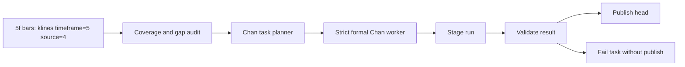

# Chan Compute Strategy V3

## Status

In progress.

Completed in code:

- `chan-service` formal engine path now uses `YuYuKunKun/chanlun.py`.
- `scheme2_chan_published_heads` is now written during Chan persistence and read by the API as the first source of truth.
- old regression tests no longer default to `J:\stock_data.db`; they require explicit opt-in.
- `chan_recompute` no longer needs the full-history HTTP `/analyze` path as its primary compute path; it now has a local continuous-state `chanlun.py` full-symbol feed path.
- runtime strict validation rejects non-`chanlun.py` engines, malformed payloads, out-of-range timestamps, reversed base ranges, and abnormal row counts.
- local scripts now support clearing only Chan compute tables and running multi-process recompute workers.

Still pending before full-market recompute:

- choose a safe local worker count based on CPU, memory, and observed per-symbol runtime
- run a small multi-symbol canary batch before all-symbol mode
- implement or explicitly defer buy/sell point extraction; current `chanlun.py` adapter publishes 0 signals

## Current State

- Existing Chan compute rows were cleared from:
  - `chan_runs`
  - `chan_strokes`
  - `chan_segments`
  - `chan_centers`
  - `chan_signals`
  - `chan_recompute_tasks`
  - `scheme2_chan_recompute_watermarks`
  - `scheme2_chan_published_heads`
- `605123.SH` was recomputed after the clear as the current runtime canary:
  - input bars: 69,191 canonical 5f bars
  - levels: `5f`, `30f`, `1d`
  - rows: 3,555 strokes, 516 segments, 479 centers, 0 signals
  - API bundle source: `database:chan-precomputed`
- `000001.SZ` long-history canary was recomputed after the clear:
  - input bars: 195,907 canonical 5f bars
  - levels: `5f`, `30f`, `1d`
  - rows: 8,113 strokes, 1,212 segments, 1,041 centers, 0 signals
  - no recursion error and no fallback output
  - API bundle source: `database:chan-precomputed`
- Canonical 5f K-line ingest remains intact.
- Current 5f bar storage uses:
  - `klines.timeframe = 5`
  - `klines.source = 4` for `parquet_5f`
  - timestamp semantics: `ts` is bar end time.
- Performance observations:
  - one-shot DB read for `605123.SH` 69,191 bars: about 7.5 seconds
  - full canary recompute with logging suppressed: about 220-232 seconds
  - full long-history `000001.SZ` recompute: about 891 seconds
  - runtime is dominated by the Python `chanlun.py` compute path, so full-market recompute should use multiple worker processes, not one process with many threads
- Operational scripts:
  - `scripts/clear-chan-compute-data.ps1 -Execute` clears only Chan compute tables, not K-line data.
  - `scripts/start-chan-recompute-worker.ps1` runs one recompute worker.
  - `scripts/start-chan-recompute-fleet.ps1` starts multiple single-concurrency worker processes.
  - `scripts/stop-chan-recompute-fleet.ps1` stops local recompute workers.
  - `scripts/watch-chan-recompute-progress.ps1 -Once` reports task, published-head, success, and failure status.
- Buy/sell signal status:
  - `YuYuKunKun/chanlun.py` has buy/sell point classes and BSP charting code in its UI/demo path.
  - The current formal adapter loads the core `chan.py` observer path; runtime introspection found only `识别买卖点` and no active `买卖点字典` / `BSP字典` containers on that observer.
  - Therefore persisted `signals=0` is an adapter capability gap, not a database or frontend issue.
  - Signal support needs a separate implementation step: either adapt the vendor `main.py` BSP logic into the core observer path, or compute strategy signals in a CZSC-style signal layer and persist them as `chan_signals`.

## Problem Summary

The previous full recompute failed because a full-history symbol request fed 195,716 5f bars into the legacy Chan engine in one batch. The legacy segment calculation uses recursive calls inside segment confirmation. For long histories this can exceed Python recursion depth.

The more serious orchestration bug was that the service then downgraded to fallback output, and the recompute worker accepted that fallback result as a successful formal Chan result. This produced invalid rows such as 138,137 strokes for one symbol.

This strategy treats fallback output as debug-only. Fallback must never be persisted as production Chan data.

## Requirements

### Functional

- Compute all Chan levels from the canonical 5f bar stream.
- 30f and daily Chan levels must be recursively derived from 5f Chan structure, not independently computed from aggregated 30f or 1d K-lines.
- Persist only formal engine output.
- Keep bars and Chan structures bound by canonical 5f bar end timestamps.
- Support full-history bootstrap and later incremental continuation.

### Non-Functional

- No fallback pollution.
- No all-market recompute without canary validation.
- No partial publish: failed runs must not replace the currently published head.
- Every persisted structure row must be traceable to canonical 5f `begin_base_ts` and `end_base_ts`.
- Worker failures must be resumable.

## Architecture Decision

### ADR-0012: Strict Formal-Only Chan Persistence

Status: In progress. The service now has a `chanlun.py` engine path for Phase 2 POC.

Decision:

The recompute worker must reject any Chan service response whose engine is not explicitly allowed for production persistence.

Allowed engines:

- future formal canonical engine
- `chan.py` only after full-history canary validation passes
- `legacy-copy` only if it passes the same canary validation without recursion or fallback

Rejected engines:

- `fallback`
- `placeholder`
- `mixed`
- any response with internal level fallback

Consequences:

- Failed symbols become failed tasks, not polluted data.
- Full-market recompute may be slower to resume, but correctness is protected.

## New Compute Pipeline

## Phase 0: Safety Guardrails

Goal: make it impossible to write fallback Chan data.

Tasks:

1. Add strict mode to Chan service analyze path.
   - Request option: `allow_fallback=false`.
   - In strict mode, formal engine exceptions return non-2xx or explicit error JSON.
   - Verification: forced engine exception does not return fallback structures.

2. Add recompute-side engine allowlist.
   - Reject `fallback`, `placeholder`, `mixed`, unknown engines.
   - Verification: mocked fallback response marks task failed and writes zero `chan_*` rows.

3. Add result sanity gates.
   - Required: all levels are present.
   - Required: every persisted stroke / segment / center has canonical base timestamps.
   - Required: timestamps are within input bar range.
   - Required: row-count circuit breaker, used only as safety stop, not as semantic validation.

Acceptance:

- A failed engine cannot produce persisted `chan_runs`.
- `chan_recompute_tasks` records the failure reason.
- Published heads remain unchanged after failure.

## Phase 1: Canonical Input Audit

Goal: ensure recompute consumes only clean canonical 5f input.

Tasks:

1. Verify every active symbol has source=4 5f coverage.
2. Check per-symbol first and last bar end.
3. Check trading-session 5f continuity with A-share calendar rules.
4. Mark incomplete symbols as blocked or partial, not ready.

Acceptance:

- Produce a table/report:
  - total symbols
  - ready symbols
  - missing symbols
  - symbols with gaps
  - min/max bar end
- No Chan task is generated for symbols that fail coverage audit unless explicitly allowed.

## Phase 2: Engine POC

Goal: choose the formal compute mode before all-market recompute.

Canary symbols:

- `000001.SZ`: long-history, known previous recursion failure
- `605123.SH`: recent listing / user validation symbol
- one STAR Market symbol
- one symbol with sparse or suspended history

POC variants:

1. `YuYuKunKun/chanlun.py` observer-state adapter, strict no fallback.
2. Current official `chan.py` adapter, kept only as a comparison path.
3. Legacy-copy analyzer, kept only as a historical comparison path.

Chosen first implementation:

- Use `chanlun.py` as the formal POC engine.
- Build one `观察者` per symbol/request.
- Feed canonical 5f bars into that observer in chronological order.
- Derive 5f / 30f / 1d structures from the same observer state:
  - 5f: `笔序列`, `线段序列组[0]`, `笔_中枢序列`
  - 30f: `线段序列组[0]`, `线段序列组[1]`, `中枢序列组[0]`
  - 1d: `线段序列组[1]`, `线段序列组[2]`, `中枢序列组[1]`
- Do not dedupe low-level segments against higher-level strokes. Shared endpoints are valid Chan structure, not duplicates.
- Do not let `chanlun.py` failures fall back to placeholder output.

Acceptance:

- No recursion error.
- No fallback engine.
- All three levels returned from one 5f-based compute.
- Output row counts are plausible.
- Endpoint timestamps map to existing 5f bars.
- Frontend renders the canary symbols without endpoint drift.

## Phase 3: Stateful Full-History Bootstrap

Goal: avoid one huge, failure-prone request per symbol.

Design:

- One compute job per symbol.
- Input is read in chronological chunks from `klines`.
- Chunks are fed into one symbol-local engine state.
- Chunks are not independently analyzed and merged.
- The worker checkpoints progress, but publishes only after complete validation.

Important rule:

Chunking is an ingestion and memory-control technique only. It must not split Chan semantics. A symbol's Chan state must be continuous from its first 5f bar to the latest 5f bar.

For the `chanlun.py` engine, this means chunks may be used only to stream rows into the same symbol-local `观察者`. Independent chunk analysis followed by merge is forbidden because it breaks inclusion, fractal, stroke, segment, and center continuity.

Acceptance:

- Worker can resume after interruption.
- Restart does not duplicate published rows.
- A failed symbol does not affect other symbols.
- Implementation status:
  - current worker reads canonical 5f bars in chronological chunks from PostgreSQL
  - chunks are fed into one symbol-local `ChanlunOverlayBuilder`
  - the worker still needs runtime canary validation on the current database before full-market execution

## Phase 4: Stage-Then-Publish Persistence

Goal: prevent partial results from becoming visible.

Tasks:

1. Write new run as `status='staged'`.
2. Insert all structures for the staged run.
3. Validate staged result.
4. Atomically update `scheme2_chan_published_heads`.
5. Mark run `success` / `published`.

Acceptance:

- API reads only published heads.
- Staged or failed rows never appear in chart responses.
- Recompute interruption leaves either old result visible or no result visible, never half-written data.

Implementation status:

- `PostgresChanWriter.replace_analysis(...)` now updates `scheme2_chan_published_heads`
  through `staged -> published` state transitions on success and `failed` on error.
- API repository now prefers `scheme2_chan_published_heads` over direct `chan_runs` scans.

## Phase 5: Incremental Continuation

Goal: after bootstrap, keep Chan results current.

Tasks:

1. On new source=4 5f bars, update `scheme2_ingest_watermarks`.
2. Mark affected symbol dirty from the earliest changed bar end.
3. Recompute from previous safe checkpoint if engine supports state restore.
4. If state restore is not available, recompute full symbol history in background and publish atomically.

Acceptance:

- New bars trigger dirty state.
- Dirty symbols eventually publish new heads.
- API can identify stale published results.

## Execution Order

1. Implement Phase 0 guardrails.
2. Run Phase 1 audit.
3. Run Phase 2 canary POC.
4. Decide engine mode based on POC result.
5. Implement Phase 3 stateful bootstrap.
6. Implement Phase 4 publish semantics.
7. Start full-market bootstrap.
8. Implement Phase 5 incremental continuation.

## Explicit Non-Goals

- Do not restart all-market recompute before strict no-fallback persistence exists.
- Do not raise Python recursion limit as the primary solution.
- Do not compute 30f or daily Chan from aggregated 30f / 1d K-lines.
- Do not let frontend repair or reinterpret backend Chan structure.
