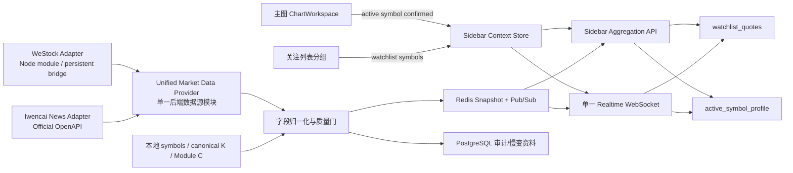
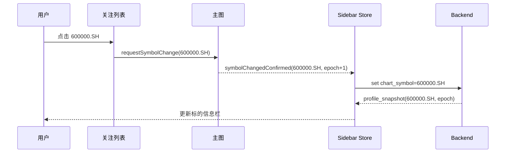

# 右侧行情侧栏统一聚合设计 V2

## 1. 修订结论

本版按以下两项决策重构：

1. **标的信息栏只绑定主图当前标的**。它不绑定关注列表、不绑定当前展开的关注分组，也不因关注列表行情刷新而切换。
2. **外部结构化行情主源改为 WeStock Data**。后端通过固定版本的 WeStock Data Provider 获取实时行情、公司资料、财务指标、资金流、板块及市场热度；浏览器不直接调用第三方接口。
3. **新闻主源采用问财官方 `news-search` Skill**。后端通过问财新闻 Provider 搜索个股、行业和政策新闻，统一去重、聚类和推送；浏览器不直接调用问财 OpenAPI。

必须区分两个独立上下文：

- `chart_context.active_symbol`：由主图当前显示的证券代码决定，唯一控制标的信息栏和个股新闻。
- `watchlist_context.symbols`：由关注列表当前用户/分组决定，只控制关注列表轻量行情。

关注列表某行被用户点击后，流程是“请求主图切换标的 -> 主图确认切换完成 -> 更新 `chart_context.active_symbol` -> 更新标的信息栏”。不能在点击行时绕过主图直接改资料卡。

## 2. WeStock Data 能力与边界

### 2.1 已确认能力

WeStock Data 使用腾讯自选股行情数据接口，覆盖沪深、科创、北交所，以及港股和美股。当前项目只启用 A 股范围。公开文档列出的主要命令包括：

- `quote`：实时行情，支持批量。
- `profile`：公司简况，支持批量。
- `finance`：财务报表，支持批量。
- `asfund`：A 股资金流向，支持批量。
- `technical`：技术指标，支持批量。
- `kline`：日、周、月等历史 K 线，支持批量，最多 2000 条。
- `minute`：1 日/5 日分时，不支持批量。
- `board`、`hot stock`、`hot board`：板块行情和市场热度。
- `chip`、`shareholder`、`dividend`、`reserve`、`suspension` 等补充资料。

命令要求 Node.js 18 以上，文档标注无需 API Key，但数据可能延迟，应以交易所数据为准。

### 2.2 本项目使用限制

- WeStock Data 是第三方 CLI 包，不是本项目的进程内稳定 SDK。生产环境必须锁定包版本和完整性哈希，禁止运行时使用 `npx -y` 自动下载最新版。
- 不在每次 HTTP 请求中启动 CLI。CLI 只由常驻 Provider Worker 调用，并经过批处理、限流、超时、熔断和缓存。
- WeStock Data 的外部 K 线不写入本项目 canonical K 线表。主图 K 线、Module C、策略和回测继续使用本地审计后的 canonical 数据。
- `minute` 不支持批量，不用于关注列表全量刷新；只可在明确打开分时功能时按单标的、限频调用。
- 公布的命令清单没有个股新闻能力。因此新闻由问财 `news-search` Skill 独立承担，不能从 WeStock 返回结构中推断或伪造新闻。
- 公开免费接口没有采购 SLA。必须保留最近成功快照和本地降级路径。

### 2.3 问财新闻搜索能力与边界

问财 `news-search` Skill 面向财经新闻与资讯搜索，可覆盖主流财经媒体、垂直行业网站、上市公司及非上市公司官网等内容，适合查询最新财经事件、政策动态、行业革新和企业业务进展。

本项目约束：

- 只在服务端安装并调用 Skill，配置仅通过 `IWENCAI_BASE_URL` 与 `IWENCAI_API_KEY` 环境变量注入。
- API Key 进入 Docker Secret/本机安全环境变量，不写入仓库、Markdown、前端构建产物、URL、日志或错误响应。
- 截图或历史日志中出现过的密钥视为已暴露，正式接入前必须轮换；方案文档不记录其值。
- 前端不按关注列表每个 symbol 发起新闻搜索。新闻只绑定 `chart_context.active_symbol`，并由后端缓存和推送。
- 问财搜索结果属于外部资讯，不直接参与 canonical K 线、Module C 或正式策略回测。
- 搜索失败时保留最近成功结果并标记 `stale`；不得退回 mock 新闻。

### 2.4 字段来源决策

| 数据域 | 权威/主来源 | 更新策略 | 降级来源 |
|---|---|---|---|
| 主图 K 线 | 本地 canonical K 线 | 现有采集与 WebSocket | 不用 WeStock 覆盖 |
| 关注列表最新价、涨跌、成交量 | WeStock `quote` 批量 | 交易时段 3~5 秒批量轮询 | 本地最新 5f/1d bar，标记延迟 |
| 当前图表标的报价 | 与关注列表共享 quote cache | 3~5 秒 | 本地最新 bar |
| 名称、交易所、上市状态 | 本地 `symbols` | 每日/主数据变更 | WeStock `profile` |
| 公司简况 | WeStock `profile` | 每日缓存 | 最近成功快照 |
| 市值、PE、PB、换手率 | WeStock quote/finance 对应字段 | 盘中 1 分钟或日更 | 最近成功快照，不用 `--` 冒充实时 |
| 资金流 | WeStock `asfund` | 1~5 分钟批量 | 最近成功快照，明确时间 |
| 板块、热门主题 | WeStock `board`/`hot board` | 1 分钟 | 本地版本化映射 |
| 缠论状态、策略信号 | 本地 Module C published head | 新 head 发布触发 | 最近完整 published head |
| 今日最强 | WeStock quote/board/hot 输入 + 本地确定性评分 | 10~30 秒 | 最近成功榜单 |
| 个股新闻、行业新闻、政策动态 | 问财 `news-search` Skill | 30~60 秒或切换主图时异步刷新 | 最近成功快照 + 交易所/巨潮公告 |

## 3. 总体架构



不把两个 CLI 暴露为两个业务数据源。后端只提供一个 `UnifiedMarketDataProvider`，内部包含两个可替换 Adapter：

```python
class UnifiedMarketDataProvider:
    async def get_quotes(self, symbols): ...
    async def get_profile(self, symbol): ...
    async def get_capital_flow(self, symbol): ...
    async def get_market_strength(self): ...
    async def get_news(self, symbol, since): ...
```

- `WeStockAdapter` 实现行情、资料、资金流和市场热度。
- `IwencaiNewsAdapter` 实现新闻搜索。
- 上层 Coordinator、Redis、FastAPI 和 WebSocket 只依赖统一接口，不知道 CLI、npm 包或问财 OpenAPI 的存在。

`UnifiedMarketDataProvider` 作为现有 collector 的单实例命令运行，写入 Redis 快照和 Pub/Sub。FastAPI 只读归一化快照，不在用户请求线程中等待任何外部源。

### 3.1 CLI 与模块复用策略

优先级如下：

1. **问财不运行 CLI**：安装并审阅 `news-search` Skill 后，将其官方 OpenAPI 合同实现为 Python `httpx` Adapter。Skill 用于确认接口、参数和返回结构，运行时不需要 shell。
2. **WeStock 优先模块调用**：安装已验签的固定版本后检查 package exports。若提供稳定 JavaScript API，则由一个常驻 Node bridge 直接 `import`，通过 JSON Lines 与 Python Provider 通信。
3. **WeStock CLI 兼容路径**：若包只提供 CLI，则常驻 bridge 调用容器内固定的本地 executable；禁止 `npx -y`、禁止每个 HTTP 请求重新安装或启动新进程。
4. **不复制私有接口实现**：不把腾讯私有端点逆向重写进 Python。这样会放大授权、反爬、字段漂移和维护风险。

对业务代码而言，无论 WeStock 最终是模块还是 CLI，都只有一个 `WeStockAdapter`。

### 3.2 Docker 与跨平台

- 本机 Windows 不需要全局安装两个 CLI；开发环境可全部通过 Docker Compose 运行。
- 当前 `Dockerfile.api` 已在 `python:3.11-slim` 中安装 Node.js/npm，说明 Linux 容器可以承载 Node 工具；正式方案把外部采集放在 collector 单实例，而不是 API 副本中。
- `Dockerfile.collector` 增加 Node.js 18+、已验签 WeStock 固定依赖和 lockfile；问财 Adapter 只需要 Python `httpx`。
- Compose 新增一个使用 collector 镜像的 `market-data-provider` service，命令为 `python -m collector.market_data_provider`。
- 镜像构建阶段完成安装与验签，运行阶段不联网安装依赖；Windows/Linux 宿主机运行的是同一 Linux 镜像。
- CI 必须在 Linux/amd64 容器执行 WeStock `quote/profile` smoke test；若未来部署 ARM64，需要单独通过 ARM64 验收，不能默认兼容。

## 4. 前端状态模型

### 4.1 独立状态

```ts
type SidebarContext = {
  chartSymbol: string;
  chartEpoch: number;
  watchlistId: string;
  watchlistSymbols: string[];
  watchlistRevision: number;
};
```

- `chartSymbol` 来自 TradingView `symbol_changed` 或项目现有主图切换完成事件。
- `chartEpoch` 每次主图确认切换后递增，用于拒绝旧标的迟到响应。
- `watchlistSymbols` 仅用于批量报价订阅。
- 标的信息栏组件只读取 `profileBySymbol[chartSymbol]`。
- 关注列表只读取 `quotesBySymbol[symbol]`。

### 4.2 关键交互时序



如果主图切换失败，资料栏保持原标的，不能提前显示被点击标的资料。

## 5. 聚合 API 合同

### 5.1 首次快照

`POST /api/v3/market/sidebar/bootstrap`

请求：

```json
{
  "chart_symbol": "000001.SZ",
  "chart_epoch": 18,
  "watchlist_id": "default",
  "watchlist_symbols": ["000001.SZ", "600000.SH"]
}
```

响应：

```json
{
  "context": {
    "chart_symbol": "000001.SZ",
    "chart_epoch": 18,
    "watchlist_revision": 7
  },
  "watchlist_quotes": {
    "000001.SZ": {},
    "600000.SH": {}
  },
  "active_symbol_profile": {
    "symbol": "000001.SZ",
    "quote": {},
    "identity": {},
    "valuation": {},
    "capital_flow": {},
    "themes": [],
    "chan_state": {},
    "strategy_signals": []
  },
  "strongest_preview": [],
  "news_preview": {
    "symbol": "000001.SZ",
    "chart_epoch": 18,
    "status": "fresh",
    "items": [],
    "as_of": "2026-07-12T09:30:00+08:00",
    "source": "iwencai_news_search"
  },
  "snapshot_version": 1024,
  "sequence": 8891
}
```

规则：

- `active_symbol_profile.symbol` 必须严格等于请求中的 `chart_symbol`。
- 资料不能从 `watchlist_symbols[0]`、选中分组或最近行情事件推断。
- 关注列表为 0 个标的时，仍可正常返回当前主图资料。
- 当前主图标的不在关注列表时，仍必须返回其资料和报价。

### 5.2 单 WebSocket 上下文

复用 `/ws/v1/realtime`：

```json
{
  "type": "set_sidebar_context",
  "subscription_id": "right-sidebar",
  "chart_symbol": "000001.SZ",
  "chart_epoch": 18,
  "watchlist_symbols": ["000001.SZ", "600000.SH"],
  "channels": ["watchlist_quotes", "active_profile", "strength", "news"]
}
```

推送类型：

- `watchlist_quote_delta`：可包含多个 symbol，只更新关注列表和共享 quote cache。
- `active_profile_delta`：必须带 `chart_symbol`、`chart_epoch`，只更新标的信息栏。
- `strength_delta`：更新今日最强。
- `news_delta`：必须带 `chart_symbol`、`chart_epoch` 和 `source=iwencai_news_search`；问财不可用时推送结构化 freshness 状态，不推送假数据。
- `sidebar_resync_required`：序列跳跃或版本不一致时触发一次 bounded resync。

前端只有在事件的 `chart_symbol + chart_epoch` 与当前上下文一致时才能提交资料更新。

## 6. WeStock Provider 适配

### 6.1 代码规范化

| 本项目 | WeStock |
|---|---|
| `600000.SH` | `sh600000` |
| `000001.SZ` | `sz000001` |
| `430047.BJ` | `bj430047` |

转换必须由纯函数完成并有沪、深、科创、北交所单元测试；不接受基于首位数字的模糊推断覆盖显式交易所后缀。

### 6.2 调用计划

- `quote`：将所有在线用户关注标的与主图标的去重，按 provider 支持上限分批；同一轮只请求一次相同 symbol。
- `profile`、`finance`：按 symbol 批量，日级 TTL；切换主图只读缓存，缓存缺失则异步补齐。
- `asfund`：批量、分钟级 TTL；不可用时保留旧值并标记 stale。
- `board`、`hot stock`、`hot board`：单独周期任务，不由侧栏打开动作触发。
- `minute`：不纳入侧栏聚合主链路。
- `technical`、`kline`：不用于替代 Module C 或 canonical K 线。

### 6.3 进程与供应链约束

- 当前 SkillHub 资源版本按 `westock-data@1.0.4` 验签并固定内容指纹；从验签 bundle 的 manifest 读取实际 npm 依赖，不根据第三方镜像示例猜测包名。
- 将实际依赖精确版本写入 package lock，不使用浮动 `latest`。
- 启动时校验 SkillHub 签名、包版本和产物哈希，失败则 provider 保持 unavailable。
- 子进程使用无 shell 参数数组，symbol 必须先通过白名单正则。
- 单次调用超时、输出大小和并发数必须有限制。
- 原始返回最多保留短期诊断样本，日志不得记录用户凭据或无限量响应正文。

## 7. 缓存、去重与新鲜度

Redis 键建议：

- `market:quote:{symbol}`：实时轻量行情，TTL 30 秒。
- `market:profile:{symbol}`：归一化资料，TTL 1 天。
- `market:finance:{symbol}`：财务/估值，按报告期版本化。
- `market:fund:{symbol}`：资金流，TTL 10 分钟。
- `market:strength:latest`：今日最强结果，TTL 2 分钟。
- `market:sidebar:snapshot:{user_id}`：可选的短期组合快照，不作为字段权威源。

每个字段域必须附带：

```json
{
  "source": "westock_data",
  "provider_version": "westock-data@1.0.4+verified-content-hash",
  "provider_ts": "2026-07-11T10:00:00+08:00",
  "received_at": "2026-07-11T10:00:02+08:00",
  "freshness": "live|delayed|stale|unavailable"
}
```

同字段多来源不做平均；按字段级优先级选择值。WeStock quote 与本地最新 bar 差异超过阈值时标记 `suspect`，但不得反向修改 canonical K 线。

## 8. 今日最强

今日最强使用 WeStock Data 作为行情与板块输入，但排名由本项目确定性计算，不直接复制热搜顺序：

- 相对指数涨幅和日内位置。
- 成交额、量比、换手和量能增速。
- 板块宽度、热门板块归属和龙头集中度。
- `asfund` 可用时加入资金流，不可用时重归一化权重。
- 本地 5f/30f Module C 状态作为独立标签，不篡改行情分数。
- 停牌、异常行情、冲高回落和数据过期扣分。

界面仅展示市场温度、前三主线、前五强股及每项最多三个强因子。小图使用 SVG/Canvas，不新增 TradingView 实例。

## 9. 问财新闻聚合设计

### 9.1 查询绑定

新闻与资料卡一样，只绑定主图已确认的 `chart_symbol + chart_epoch`，不绑定关注列表。切换关注分组不会触发新闻请求；主图确认切换后才更新新闻上下文。

检索模板由后端生成，第一阶段固定为三组：

- 个股事件：`{证券名称} {证券代码} 最新公告 业务进展 业绩 重大事项`。
- 行业联动：`{所属行业/主题} 最新政策 行业动态 产业链变化`。
- 风险事件：`{证券名称} 监管 问询 处罚 诉讼 减持 风险`。

禁止把任意用户输入直接拼接进 OpenAPI 请求；symbol、公司名和行业名必须来自已校验主数据。

### 9.2 归一化事件结构

```json
{
  "event_id": "sha256:...",
  "symbol": "000001.SZ",
  "category": "company|industry|policy|risk|announcement",
  "title": "...",
  "fact_summary": "...",
  "impact_tags": ["业绩", "银行"],
  "published_at": "2026-07-12T08:30:00+08:00",
  "first_seen_at": "2026-07-12T08:30:20+08:00",
  "sources": [{"name": "...", "url": "..."}],
  "source": "iwencai_news_search",
  "freshness": "fresh"
}
```

`fact_summary` 只压缩来源中的事实，不生成买卖建议。摘要失败时回退为标题和原始导语。

### 9.3 去重、聚类与排序

- 一级唯一键：问财结果 ID 或规范化原文 URL。
- 无稳定 ID 时：`normalized_title + published_at_bucket + primary_entity` 哈希。
- 同事件多媒体转载使用标题相似度、实体集合和发布时间窗口聚类为一张卡。
- 卡片保留所有来源，优先展示公司公告、交易所、权威财经媒体的首发来源。
- 排序分数：`标的相关性 × 事件重要性 × 新鲜度 × 来源可靠度`。
- 默认只显示 5 条；风险、公告和业绩事件可置顶，但必须显示类别和时间。

### 9.4 调度与缓存

- 主图切换：缓存命中立即返回；缓存缺失时排队查询，不阻塞 bootstrap。
- 交易时段：当前在线主图标的每 30~60 秒刷新；相同 symbol 的并发请求合并。
- 非交易时段：5~15 分钟刷新；公告事件可由独立公告采集触发。
- Redis：`market:news:{symbol}`，fresh TTL 90 秒，stale 可见窗口 24 小时。
- PostgreSQL：保存规范化事件、来源关系和首次发现时间，用于审计与去重。
- 问财限流或故障时指数退避，不允许每个浏览器独立触发外部请求。

### 9.5 安全边界

- `IWENCAI_API_KEY` 只存在服务端 secret；前端仅收到归一化新闻数据。
- API Key、Authorization、完整错误响应和请求头全部经过日志脱敏。
- 当前截图里出现过的 key 必须在接入前轮换，旧 key 不得继续作为生产凭据。
- Provider 启动时只检查变量是否存在，不输出其值。
- 问财 Skill 或 OpenAPI 不可用时，界面显示“新闻延迟/不可用”和最近更新时间，不展示 mock 内容。

## 10. 性能验收

| 指标 | 验收值 |
|---|---:|
| Redis 命中时侧栏 bootstrap | p95 < 200 ms |
| 主图切换后资料卡可见 | p95 < 250 ms；缓存命中 p95 < 120 ms |
| 100 个关注标的报价更新 | 单轮 provider 批量调用，不允许 100 次独立调用 |
| 行情到 UI 新鲜度 | p95 < 10 秒；目标 5 秒 |
| WebSocket 收到后渲染 | p95 < 100 ms |
| 今日最强重算 | 全市场 p95 < 2 秒 |
| 新闻缓存命中后可见 | p95 < 150 ms |
| 问财新查询完成 | p95 < 3 秒；超时上限 5 秒，不能阻塞资料卡 |
| 新闻新鲜度 | 交易时段 p95 < 90 秒 |
| 前端 HTTP 请求 | 首开 1 次 bootstrap；切图缓存命中不新增资料域散请求 |
| WebSocket | 每浏览器 1 条连接，切换 20 次标的不增加连接数 |
| 外部 Provider 进程 | 全部署仅 1 个 market-data-provider 单实例；API 副本不启动 CLI |

必须通过以下行为测试：

1. 当前主图为 A、关注列表仅含 B/C：资料栏仍显示 A。
2. 展开或切换关注分组：资料栏不变化。
3. 点击 B 但主图切换失败：资料栏保持 A。
4. 主图成功切到 B：收到确认后资料栏才切 B。
5. A -> B -> A 快速切换：第一个 A 和 B 的迟到响应不能覆盖最后一个 A。
6. 主图标的不在关注列表：资料、Module C 状态和策略信号正常显示。
7. WeStock 不可用：保留最近快照并显示 stale/unavailable，不清空成假零值。
8. WebSocket 断线恢复：只执行一次 bounded resync，不回放旧 epoch。
9. 展开或切换关注分组：不触发问财新闻查询。
10. A -> B -> A 快速切换：迟到的 B 新闻不能覆盖最终 A；相同 A 查询必须合并。
11. 问财超时、限流或鉴权失败：资料卡和关注列表正常工作，新闻显示结构化降级状态。
12. 自动扫描前端资源、HTTP/WS payload 和日志：不得出现 `IWENCAI_API_KEY` 的值。
13. 在纯 Linux Docker 环境、宿主机未安装 Node/CLI 时，行情、资料和新闻 smoke test 均通过。
14. 运行期间网络断开 npm/SkillHub 安装源后，已构建镜像仍能启动；不得执行运行时 `npx -y`。

## 11. 分阶段任务

### Phase A：上下文解绑与前端合同

- 建立 `chartSymbol/chartEpoch` 与 `watchlistSymbols/watchlistRevision` 独立状态。
- 标的信息栏和个股新闻彻底移除对当前关注分组、列表首项和列表选中态的隐式依赖。
- 建立 bootstrap 和 WebSocket schema、运行时校验与 A/B/A 竞态测试。

验收：第 10 节行为测试 1~6、9~10 全部通过；网络面板无逐字段资料请求或关注列表逐标的新闻请求。

### Phase B：统一数据源模块与 WeStock Adapter

- 新增 `UnifiedMarketDataProvider` 统一接口和 collector 单实例命令。
- 安装、验签并锁定 WeStock Data 精确版本；探测 package exports，选择模块 bridge 或固定 CLI 兼容路径。
- 实现代码映射、批量调度、schema 解析、超时、熔断、限流和 Redis 快照。
- 先接 `quote/profile/finance/asfund`，不接外部 K 线覆盖 canonical 表。

验收：沪深科创北交所样本字段映射正确；100 标的批量测试无 N+1；供应商异常不会阻塞 FastAPI 请求线程；Linux CI 与 Docker smoke test 通过；宿主机不安装 CLI 仍可运行。

### Phase C：聚合 API 与实时推送

- 实现单次 bootstrap、共享 quote cache 和单 WebSocket 上下文更新。
- 增加 sequence/version/epoch fencing 与 bounded resync。
- 所有字段带来源和新鲜度。

验收：第 10 节全部性能及故障测试通过。

### Phase D：今日最强与问财新闻

- 接入 WeStock board/hot 输入和本地确定性评分。
- 在同一个 `UnifiedMarketDataProvider` 中接入问财 `news-search` OpenAPI Adapter，完成三类固定查询、事件归一化、去重聚类和缓存。
- 合并本地交易所/巨潮公告；删除生产 mock 新闻和前端逐标的新闻请求。

验收：排名可按相同输入离线复算；每个结果可追溯因子和数据版本；同一新闻事件只显示一次；A -> B -> A 切换时迟到的 B 新闻不能覆盖 A；前端和日志均不出现问财 API Key。

## 12. ADR-002：双上下文、单聚合链路、WeStock 主适配器

**状态：Proposed**

决定：标的信息栏和个股新闻绑定主图已确认标的；关注列表只维护独立报价集合。两类上下文共享后端缓存和一条 WebSocket，但不共享选择状态。结构化外部数据以 WeStock Data 为主适配器，新闻以问财 `news-search` Skill 为主适配器，本地 canonical K 线与 Module C 继续作为策略权威数据。

收益：消除资料卡错绑关注列表的问题；减少重复请求；WeStock 批量能力得到利用；前端不暴露第三方实现；策略数据不被外部行情污染。

代价：需维护 WeStock CLI Worker、问财新闻 Provider、两套外部源的版本/凭据/限流，以及统一的数据新鲜度和降级机制。

拒绝方案：

- 资料卡绑定关注列表选中项：与主图可能不一致，拒绝。
- 浏览器直接运行或调用 WeStock：存在凭证、跨域、供应链和请求失控风险，拒绝。
- 每个资料区块独立调用 CLI：产生进程风暴和 N+1，拒绝。
- 用 WeStock K 线覆盖 canonical K 线：破坏审计、Module C 与回测一致性，拒绝。
- 让 WeStock 承担其未公开的新闻能力：不可验证，拒绝；新闻明确交给问财 `news-search`。

## 13. 参考资料

- WeStock Data Skill 页面：https://skillhub.cn/skills/westockdata
- WeStock Data 公开能力镜像：https://jindage.com/skills/westock-data
- WeStock Data 第三方安全与质量分析：https://skillscope.sh/skill/i2pikamom/westockdata
- 问财 SkillHub 新闻搜索：问财 SkillHub 中的官方 `news-search` Skill（运行时仅使用服务端环境变量）
