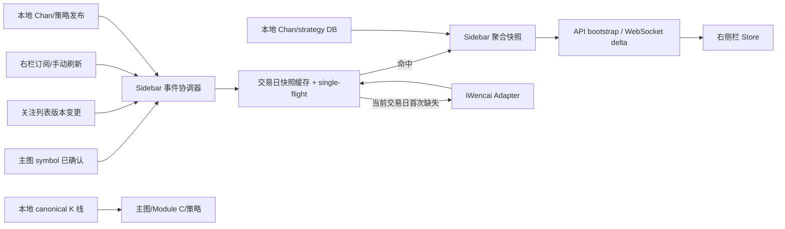

# iWencai 右侧栏 V2 实施任务清单

## 0. 目标、前提与完成定义

### 已确认决策

- iWencai 是右侧栏、关注列表展示和标的资料卡的**唯一外部数据源**。行情、估值、资金流、行业/概念、市场强弱、新闻及资料卡中的其他外部字段，均由 iWencai 获取和归一化。
- 缠论状态和策略信号继续只读本地数据库的已发布结果；不得由 iWencai 覆盖、补全或参与计算。
- 主图 K 线、历史 K 线、实时 K 线、Module C 输入和策略/回测输入继续使用本地 canonical K 线库；不得调用或写入 iWencai K 线。
- 仅事件驱动，禁止轮询。浏览器、API 和 provider 都不得创建 `setInterval`、定时轮询任务或按固定周期抓取外部接口。
- 每个 iWencai 字段域以中国交易日为缓存边界：同一 `trading_date` 内命中成功快照时复用；下一个交易日首个相关事件才允许重新获取。非交易日沿用最近交易日快照并明确标为 `stale`，不为“刷新”而外呼。
- 本阶段不提交、不推送、不创建 PR。其他 agent 正在并发修改工作区；实现者只能修改自己负责的文件，不得回滚、格式化或覆盖他人的改动。

### 成功标准

1. 右侧栏初始快照和后续 WebSocket 增量只消费已归一化的 iWencai 快照及本地 Chan/strategy 投影。
2. 外部 iWencai 请求只由明确事件触发，并对同一交易日、同一字段域、同一 symbol 去重；同一事件的并发订阅者共享单次请求。
3. 任何 iWencai 故障都不影响本地 K 线图、Chan 覆盖层、策略信号或关注列表成员关系；界面显示最近成功值及 `stale`/`unavailable` 状态。
4. 代码、合约和测试可证明不存在 WeStock/本地 K 线对外部字段的回退路径，也不存在轮询。

## 1. 架构与精确边界

### 1.1 数据所有权矩阵

| 区域/字段 | 权威来源 | 读取路径 | 禁止事项 |
| --- | --- | --- | --- |
| 主图 OHLCV、历史和实时 K 线 | 本地 canonical K 线数据库 | 现有 chart/datafeed/collector | iWencai K 线不得读取、写入或参与修复 |
| 缠论状态、买卖点、笔/线段/中枢、已发布 head | 本地 Module C/Chan 数据库 | 现有 Chan API 与实时流 | iWencai 不得生成、覆盖或排序 |
| 策略信号、信号生命周期、策略标签 | 本地 strategy 数据库 | 现有 strategy/Chan 投影 | iWencai 新闻、行情不得改写信号 |
| 关注列表定义、分组、排序、用户设置 | 本地用户设置/数据库 | `watchlistStore` 与用户设置 API | 不把 iWencai 当作用户资产来源 |
| 关注列表每行展示值 | iWencai | 标准化 quote 快照 | 不从 local quote/K 线、WeStock 或 mock 补值 |
| 标的资料卡（名称、交易所、报价、估值、资金、行业、概念、新闻） | iWencai | 标准化 profile/news 快照 | 不从本地 K 线推导或回退 |
| 市场强弱、热点、板块 | iWencai | 标准化 strength 快照 | 不保留 WeStock 输入或本地行情混算 |

“展示值”包含当前价、涨跌、成交量/额、PE/PB/市值/换手率、资金流、行业、概念、市场强度、热点和新闻。字段缺失必须传递 `null` 和 freshness 元数据，不能用本地 bar 或占位数字伪造。

### 1.2 目标链路

允许的外呼触发事件仅为：右栏首次订阅、主图 `symbolChangedConfirmed`、关注列表 revision 变更、用户显式点击“刷新”、当前交易日缓存缺失，以及本地 Chan/strategy 发布事件（后者只读取本地库，**不**外呼 iWencai）。首次 API bootstrap 不得在请求线程同步等待外部服务：先返回已有快照；若当前交易日缺失，投递去重的异步填充并通过同一 WebSocket 推送结果。

### 1.3 缓存和 freshness 合约

- 键：`sidebar:iwencai:{trading_date}:{domain}:{symbol-or-market}`，`domain` 为 `quote`、`profile`、`capital_flow`、`themes`、`strength`、`news`；对象必须包含 `source=iwencai`、`provider_ts`、`received_at`、`trading_date`、`freshness`、`snapshot_version`。
- 交易日由统一交易日历解析，时区固定 `Asia/Shanghai`；缓存物理过期时间为下一交易日首次开市后留有短暂清理窗口，但业务有效性必须首先比较 `trading_date`，不能仅依赖 TTL。
- `freshness` 只能是 `fresh|stale|unavailable`。成功结果在当天为 `fresh`；外呼失败但有最近成功结果为 `stale`；从未成功为 `unavailable`。不得降级为 local quote、WeStock、mock 或空字段冒充 fresh。
- 必须按 `(trading_date, domain, symbol)` single-flight；同一 key 的并发事件共享同一 task/Promise。事件重复、乱序或仅 UI 重渲染不得额外外呼。
- 手动刷新只能在当前交易日尚未成功获取的字段域上触发；已成功的当日快照仍直接返回缓存。若需要运营级强制失效，必须是受鉴权的维护命令，并记录审计事件，不暴露给前端。

## 2. 分阶段任务

### 阶段 A：冻结合约与删源清单

**依赖：无。完成后才可并行开展 B、C、D。**

1. 更新市场数据领域合约，明确 `IwencaiSidebarProvider` 是 sidebar 唯一外部 provider，并在类型中携带来源、交易日、freshness、快照版本和错误分类。
   - 文件范围：`services/collector/collector/market_data/contracts.py`、`provider.py`、`factory.py`、`iwencai.py`、`iwencai_contract.py`。
   - 要求：删除/隔离 `WeStockAdapter`、`LocalQuoteProvider` 在 sidebar 聚合注册表中的选择权；现有文件可暂留给非 sidebar 用途，但不得被 factory 或 coordinator 引用。
   - 测试：`test_market_data_factory.py` 断言 factory 只装配 iWencai；全仓 `rg` 断言 sidebar 路径没有 `westock`/`local_quotes` import。

2. 固化 API 和 WebSocket wire contract，所有外部字段域都声明 `source: "iwencai"`、`freshness`、`as_of` 和 `trading_date`；Chan/strategy 子对象声明 `source: "local_db"`。
   - 文件范围：`services/api/app/market_sidebar/dto.py`、`router.py`、`apps/web/src/api/marketContracts.ts`、`marketSidebar.ts`。
   - 要求：保留现有 `chart_symbol + chart_epoch` 栅栏、`watchlist_id + watchlist_revision` 栅栏、`sequence` 和 `snapshot_version`；新字段只能向后兼容添加。
   - 测试：Python/TypeScript 合约测试覆盖 source 不匹配、缺少交易日、非法 freshness、profile symbol 与 chart context 不一致。

### 阶段 B：iWencai 适配器与交易日缓存

**依赖：A1。可与阶段 C 并行。**

3. 扩展 iWencai Adapter，使其覆盖 quote、profile、valuation、capital flow、themes、market strength 和 news；每种请求有严格的请求/响应 schema 校验和字段归一化。
   - 文件范围：`services/collector/collector/market_data/iwencai.py`、`iwencai_contract.py`；如拆分需要，仅新增同目录内 `iwencai_sidebar.py` 与对应测试。
   - 要求：复用已受控的 `IWENCAI_BASE_URL`、`IWENCAI_API_KEY`、HTTPS host allowlist、5 秒硬超时、禁止重定向；密钥不得进入日志、DTO、浏览器或测试夹具。
   - 要求：名称/行业等查询词只能来自受校验的本地证券主数据；iWencai 返回内容视为不可信输入，限制数组长度、字符串长度、URL scheme、数值有限性和时间格式。
   - 测试：请求构造、HTTP 401/403/429/5xx、超时、畸形 JSON、字段缺失、超长文本、恶意 URL、部分字段为 null 和正常多标的批量响应。

4. 实现交易日快照仓库及 single-flight 协调器，替换现有按分钟/TTL 的内存回退语义。
   - 文件范围：`services/collector/collector/market_data/coordinator.py`，必要时新增 `trading_day_cache.py`；运行时入口 `market_data_provider.py`；缓存配置只在既有配置模块/环境样例中增补。
   - 要求：缓存必须可跨 API worker 共享（生产 Redis；测试可用内存实现），同时在进程内 single-flight 和 Redis 分布式锁/租约之间定义唯一 leader。leader 成功后发布领域事件，follower 不重试轮询。
   - 要求：只有收到 1.2 中列举的事件才调用 `ensure_snapshot`；不得在 `while` 循环、cron、worker tick 或 WebSocket 心跳中抓取。
   - 测试：同 key 100 个并发请求只产生一次 transport 调用；同日二次订阅零调用；跨交易日首次事件一次调用；失败保留 stale；无成功缓存返回 unavailable；非交易日零调用。

5. 将新闻由“每次资料加载立即三路搜索”改为事件驱动且按交易日去重的领域填充。
   - 文件范围：`services/collector/collector/market_data/news.py`、`iwencai.py`、`coordinator.py` 及现有新闻测试。
   - 要求：同一 symbol 当天的公司/行业/风险查询合并到一个 news 领域快照；切换回同一标的不重搜；新闻失败不阻塞 quote/profile 的发布。
   - 测试：快速切换 A→B→A、同 symbol 多客户端、news 单域失败、过期新闻和去重/排序稳定性。

### 阶段 C：API、数据库投影与事件发布

**依赖：A2、B4。**

6. 重写 sidebar repository/service 的组装顺序：读取 iWencai 快照作为全部外部字段；单独读取本地 Chan/strategy 投影；不读取 local quote 或 K 线表来填充资料卡/关注行。
   - 文件范围：`services/api/app/market_sidebar/repository.py`、`service.py`、`dto.py`、`router.py`、`services/api/app/main.py`。
   - 要求：bootstrap 只读快照，缓存缺失时返回 `unavailable` 结构并发布填充事件；不得阻塞 FastAPI 请求等待 iWencai。
   - 要求：关注列表为空、当前 chart symbol 不在关注列表、Chan/strategy 为空、iWencai 部分域失败均是合法结果。
   - 测试：`services/api/tests/test_market_sidebar.py` 覆盖来源隔离、全部降级状态、context 栅栏、缓存命中不外呼、bootstrap 延迟上限。

7. 将 provider 成功/失败和本地 Chan/strategy 发布转换为显式 Pub/Sub 事件，并只向匹配 sidebar context 的订阅者发 delta。
   - 文件范围：`services/collector/collector/realtime_publisher.py`、`services/api/app/routes/realtime.py`、`services/api/app/realtime/`、`services/api/tests/test_realtime.py`。
   - 事件：`watchlist_quote_delta`、`active_profile_delta`、`strength_delta`、`news_delta`、`chan_strategy_delta`（如现有协议已分流则沿用），以及 `sidebar_resync_required`。
   - 要求：provider 状态变化才发事件；WebSocket ping/pong、重连和订阅确认都不触发外呼。事件必须携带 context fence、来源、trading_date、sequence、snapshot_version。
   - 测试：乱序、重复、旧 epoch、旧 watchlist revision、断线重连、缓存填充完成后单次推送和无订阅者时不填充全市场。

### 阶段 D：前端消费与交互边界

**依赖：A2、C6、C7。**

8. 调整 transport 和 store，使右侧栏只因明确 UI/图表事件设置上下文；移除所有前端定时刷新、自动 retry timer 和逐行外部请求。
   - 文件范围：`apps/web/src/api/marketSidebar.ts`、`marketSidebarStore.ts`、`realtime.ts`、`watchlistStore.ts`、`ChartWorkspace.tsx`。
   - 要求：仅在主图确认切换后调用 `confirmChartSymbol`；点击关注行仍先请求主图切换，不能直接换资料卡。watchlist 变更仅更新订阅 context；同一 context 不重复 bootstrap。
   - 要求：保留现有 stream identity、sequence 和 epoch 防旧包逻辑；解析 `source/trading_date/freshness`，将 stale/unavailable 显式暴露给组件。
   - 测试：`marketSidebar.contract.test.ts`、`marketSidebarStore` 测试覆盖无 timer、旧事件拒绝、同日重入不 bootstrap、主图切换失败不换资料卡。

9. 更新右栏组件的数据呈现，分别显示 iWencai 外部字段和本地 Chan/strategy 标识，且缺失值不误导为实时数据。
   - 文件范围：`apps/web/src/components/RightSidebar.tsx`、`WatchlistPanel.tsx`、`StrongestTodayPanel.tsx` 及其现有 contract/component tests。
   - 要求：每个外部区域显示“同花顺 iWencai / 截至时间 / stale 或 unavailable”状态；Chan/strategy 显示“本地已发布”状态。不得显示外部 K 线入口或使用外部报价覆盖图表价。
   - 测试：截图/组件测试覆盖 fresh、stale、unavailable、空关注列表、chart symbol 不在列表、Chan/strategy 独立可用。

### 阶段 E：部署、观测与验收演练

**依赖：B、C、D。**

10. 配置运行时、指标和告警，不引入任何轮询式健康检查抓取。
   - 文件范围：`services/collector/collector/market_data_provider.py`、部署 Compose/Docker 配置、`.env.example`、运行手册；仅修改实施所需项。
   - 要求：记录请求数、缓存命中率、single-flight 合并数、各领域 freshness、外呼耗时、失败类型、事件端到端延迟；日志只记录 symbol hash/计数/错误类别，绝不记录 API key、Authorization、完整新闻正文或用户上下文。
   - 要求：health endpoint 仅报告进程和最近快照状态，不主动调用 iWencai。
   - 测试：容器启动 smoke、缺少密钥 fail-closed、健康检查零外呼、指标字段存在。

11. 执行集成验收和回滚演练；在用户验证前保留改动为未提交工作区状态。
   - 文件范围：测试与运行手册，不创建 Git 提交。
   - 验证命令由实施者根据仓库现有工具链选择，至少包括 collector 单测、API 单测、web 合约/组件测试、生产构建和一次浏览器端手工场景。

## 3. 依赖与并行顺序

| 工作包 | 前置 | 可并行 | 交付门槛 |
| --- | --- | --- | --- |
| A 合约/删源 | 无 | 否 | 来源矩阵与 DTO 定稿 |
| B iWencai/缓存 | A1 | 与 C 的本地投影准备并行 | 交易日缓存和 single-flight 测试通过 |
| C API/事件 | A2+B4 | 与 D 的纯 UI 模板准备并行 | bootstrap 非阻塞、delta 可路由 |
| D 前端 | A2+C6+C7 | 否 | 无轮询、context 栅栏和状态呈现通过 |
| E 部署/验收 | B+C+D | 否 | SLO、故障降级、回滚演练通过 |

跨 agent 协作规则：先在任务描述中登记要修改的文件；不得修改本计划之外的文档；遇到他人已改同一文件时，以其当前内容为基线做最小合并，不使用 `git checkout`、`reset`、批量 formatter 或删除未归属代码。

## 4. 性能与可靠性 SLO

| 指标 | SLO | 测量方式 |
| --- | --- | --- |
| 缓存命中 bootstrap API | p95 < 150 ms，p99 < 300 ms | API server span，不含网络外呼 |
| 缓存缺失 bootstrap API | p95 < 300 ms，立即返回 unavailable/旧快照 | API 不等待 iWencai |
| iWencai 事件填充到 WebSocket delta | p95 < 6 s，p99 < 8 s | 从事件入队到客户端可见 |
| iWencai 单请求 | 硬超时 5 s | adapter timeout |
| 同一交易日重复订阅 | 100% 不外呼 | transport spy + 指标 |
| 同 key 并发 100 订阅 | 外呼次数 = 1 | single-flight 压测 |
| 无订阅者时的外呼 | 0 | provider 指标 |
| K 线/Chan/strategy 可用性 | 不受 iWencai 故障影响 | iWencai 500 故障注入 |
| 轮询 | 0 个固定周期外呼任务 | 静态搜索 + 运行时 spy |

## 5. 回滚方案

1. 功能开关仅控制“右侧栏外部字段 provider 是否启用”，默认安全行为为读取最近快照并标记 `unavailable`；开关关闭后不得回退到 WeStock、local quotes 或 iWencai K 线。
2. 出现认证、schema 漂移、429 或大面积超时，停止新外呼并保留当前交易日最近成功快照为 `stale`；本地 K 线、Chan 与 strategy 保持原链路。
3. API/前端合约异常时，回退到上一个已验证的 sidebar 应用版本或禁用右侧栏外部卡片；不迁移、不删除、不重写 canonical K 线、Chan 或 strategy 数据。
4. 回滚前导出当前交易日快照元数据和错误计数用于排障；不导出密钥、Authorization 或完整第三方响应。回滚操作必须通过部署版本/配置完成，禁止用 Git reset 覆盖其他 agent 的工作区改动。

## 6. 最终验收清单

- [ ] 静态审查证明 sidebar/watchlist/profile 的外部字段只有 iWencai；WeStock 和 local quote 不在该调用图中。
- [ ] 主图 K 线请求、canonical 表写入、Module C 输入和策略计算均未新增 iWencai 调用。
- [ ] Chan 状态和策略信号响应带 `local_db` 来源，且 iWencai 不可用时仍正常展示。
- [ ] 首次订阅、确认切换主图、修改关注列表、显式刷新和本地发布事件是仅有触发源；运行 30 分钟且无新事件时外呼次数为 0。
- [ ] 同一交易日内反复进入/离开右栏、A→B→A 切换、多个客户端订阅同一标的，均命中缓存且每个领域每 key 至多一次外呼。
- [ ] 下一交易日首个相关事件重新填充；非交易日显示最近交易日 stale 快照而不外呼。
- [ ] iWencai 401、429、超时、返回畸形数据和部分字段缺失分别产生正确 freshness 和可读错误状态，无伪造报价。
- [ ] WebSocket 对旧 epoch、旧 revision、旧 stream、重复 sequence 和乱序 delta 均拒绝；重连后 bounded resync 正确。
- [ ] 满足第 4 节 SLO，并完成 API、collector、web 测试和浏览器手工验证。
- [ ] 用户验证前未执行 `git add`、`git commit`、`git push` 或创建 PR。
