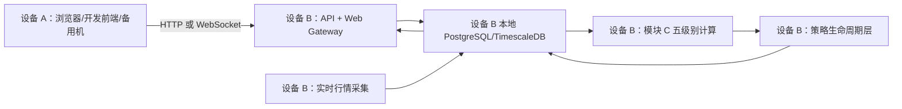

# 设备 B 后端迁移、模块 C 全量重算与生命周期建设交接说明

> 文档日期：2026-07-10  
> 目标读者：设备 B 上运行的 Codex 及项目维护人员  
> 目标：把数据库、实时采集、模块 C、API、Redis 和策略生命周期层统一迁移到设备 B，并在不影响旧数据回滚的前提下完成“不允许次高/次低成笔”的五级别全量重算。  
> 本文是执行交接文档，不代表所有必要代码已经实现。带有“必须先实现”的步骤在完成和测试前不得启动正式重算。

## 1. 最重要的结论

设备 B（12 核 24 线程、96GB 内存、约 500GB 剩余空间）更适合承担本项目后端。推荐架构是：



必须遵守以下原则：

1. 数据库文件必须放在设备 B 的本地磁盘；SMB 只用于迁移文件，不能作为 PostgreSQL 长期数据目录。
2. 迁移完成后，设备 A 和 B 不能同时运行数据库写入、行情采集或缠论发布 worker。
3. PostgreSQL、实时采集、模块 C、生命周期层必须作为一个写入单元统一部署到 B。
4. 前端可以在 A 或 B；浏览器只能通过 HTTP/WebSocket 调用 B 的 API，不能直接访问数据库。
5. 旧模块 C 数据不能先删除。新结果必须影子计算、验收、原子切换，旧结果至少保留 7 至 14 天用于回滚。
6. 一次“当前最新状态全量重算”不能生成真实历史 `first_seen_time`。它只能生成结构 `point_time` 和一个生命周期基线；历史生命周期必须另做逐时点回放。

## 2. 当前项目和数据库事实

### 2.1 当前代码状态

- 工作区：`C:/Users/yangyang/Documents/Codex/2026-06-13/tradingview-tradingview-a-5f-15f-30f`
- Git 分支：`master`
- 当前提交：`28d87f68cf6981544b0a02505ba72893905a2a7e`
- 工作区存在大量未提交和未跟踪文件。设备 B 不能只按上述提交重新 clone，否则会缺少模块 C、实时流水线、策略服务及迁移 SQL 等关键代码。
- 必须同步当前完整工作区，重点保留：
  - `work/vendor/chan.py-main`
  - `apps/web/public/charting_library`
  - `libs/protocol/python/trading_protocol/module_c.py`
  - `services/collector/collector/chan_module_c_recompute.py`
  - `services/collector/collector/chan_c_stream.py`
  - `services/collector/collector/realtime_pipeline.py`
  - `services/strategy-service`
  - `db/sql/019` 至 `db/sql/024`

严禁把 `deploy/backend.env`、API token、LLM key、Wencai cookie 等密钥打入源码包或交接文档。B 上应从 `deploy/backend.env.example` 新建本地 `deploy/backend.env`。

### 2.2 当前数据库版本和路径

- PostgreSQL：`16.14`
- TimescaleDB：`2.27.2`
- 当前镜像 ID：`sha256:8b54d1b1600306c633d9968ca975af33eb7677c230a50e6d12434de0a97b8f61`
- 当前镜像 digest：`timescale/timescaledb@sha256:fdce0a44280da4168ed8e2251f91f813c1e5df9c1c117e16ab7e3bbdbedfca11`
- 当前 PGDATA：`D:/tv-a-share-db/postgres-data`
- 当前模块 C tablespace：`G:/tv-a-share-db/postgres-tablespaces`
- 容器内固定挂载点：
  - `/var/lib/postgresql/data`
  - `/var/lib/postgresql/tablespaces_g`
- 当前数据库逻辑体积约 `234GB`。
- 当前模块 C 表总计约 `14GB`，其中笔约 8.25GB、买卖点约 4.13GB、线段约 1.28GB、中枢约 0.75GB。

设备 B 必须使用相同 PostgreSQL 主版本、TimescaleDB 版本和容器内挂载路径。迁移阶段不要继续使用浮动的 `latest-pg16`；先把 compose 镜像固定到上述 digest，完成验证后再讨论升级。

### 2.3 当前数据水位

- 活跃标的：`5,522`
- 具备 5f/30f/1d/1w/1m 五级别 ingest watermark 的活跃标的：`5,521`
- 模块 C run：`37,471`
- 成功 run：`36,827`
- historical backfill run：`28,585`
- 当前 published head：`8,535`
- published head 覆盖标的：约 `1,403`
- `strategy_signal_events`：`0` 条
- `scheme2_chan_c_published_head_history`：当前数据库尚未创建

### 2.4 当前模块 C 语义问题

用户要求：不允许次高、次低成笔，但继续使用“新笔”间隔规则。正确配置是：

```text
bi_strict = false
bi_allow_sub_peak = false
```

两者含义不同：

- `bi_strict=false`：使用新笔的分型间隔规则。
- `bi_allow_sub_peak=false`：不允许次高、次低作为笔端点。

当前源码合同已经是：

```text
module-c:native-5lvl-v4-bi-strict-false-bi-allow-sub-peak-false
```

但当前数据库 published head 中没有任何一条能证明使用了 v4：

- 4,211 个 head 的关联配置为空；
- 4,206 个 head 来自旧 `module-c:chan.py-native-tail-v1`；
- 118 个 head 来自 `module-c:native-5lvl-v3-bi-strict-false`；
- v4 head 为 0。

因此需要全量重算，但不得直接清空现有表。

## 3. 目标部署拓扑

### 3.1 设备 B 常驻服务

设备 B 最终常驻：

- `timescaledb`
- `redis`
- `chan-service`
- `api`
- `web-gateway`
- `realtime-pipeline-fetch-worker`
- `chan-c-stream-worker`
- 策略生命周期 publisher/observer

只能手动启动、不能常驻并行：

- `market-fill-worker`
- `history-backfill-worker`
- 全量 `chan_module_c_recompute`
- legacy `realtime-pipeline-chan-worker`
- 独立 `chan-tail-publisher-worker`

不得同时运行 legacy chan worker、独立 tail publisher 和 Module C stream worker。

### 3.2 局域网端口

推荐只向局域网开放：

| 服务 | 端口 | 访问范围 |
|---|---:|---|
| Web Gateway | 8080 | A 或其他浏览器设备 |
| API | 8001 | A 的开发前端或调试工具 |
| 前端开发服务器 | 5173 | 仅需要前端开发时 |

默认继续只绑定 B 本机：

| 服务 | 端口 | 原因 |
|---|---:|---|
| PostgreSQL | 15432/5432 | 不应长期向局域网暴露 |
| Redis | 6379 | 只供后端内部使用 |
| chan-service | 8002 | 只供 API/collector 内部使用 |

Windows 防火墙仅允许 A 的 IP 或本地子网访问 8001/8080。生产页面优先访问：

```text
http://<B_IP>:8080
```

若 A 上运行 Vite 开发前端：

```text
http://<A_IP>:5173/?apiBaseUrl=http://<B_IP>:8001
```

B 的 `CORS_ORIGINS` 必须加入 A 的 5173 地址。

## 4. 源码传输方案

当前工作区很脏，不能只 clone Git。推荐在 B 创建临时 SMB 共享，然后从 A 复制完整工作区。

示例命令仅作为模板，先替换 `<B_IP>` 和共享名：

```powershell
robocopy `
  "C:\Users\yangyang\Documents\Codex\2026-06-13\tradingview-tradingview-a-5f-15f-30f" `
  "\\<B_IP>\tv-transfer\workspace" `
  /E /Z /J /MT:8 /COPY:DAT /DCOPY:DAT /R:3 /W:5 `
  /XD logs node_modules __pycache__ .pytest_cache .mypy_cache dist build `
  /XF backend.env backend.env.nas "*.pyc" "*.log"
```

注意：

1. 不要删除 `work/vendor/chan.py-main`。
2. 不要删除 `apps/web/public/charting_library`。
3. 不要传输 `deploy/backend.env`。
4. B 复制完成后执行 `git status --short`，并与 A 的文件清单核对。
5. B 必须确认 `libs/protocol/python/trading_protocol/module_c.py` 中 `bi_allow_sub_peak=false`。

## 5. 数据库迁移方式选择

### 5.1 推荐：停机后通过 SMB 物理复制

适用条件：A、B 都使用 x86-64 Docker，B 能运行同一 TimescaleDB 镜像，允许约 1 至 3 小时停机。

优点：

- 传输最快；
- 不需要生成超大的 SQL dump；
- 能完整保留 hypertable、索引、run、tablespace 和 K 线。

缺点：

- 复制期间后端停机；
- 必须复制 PGDATA 和 G 盘 tablespace 两部分；
- 容器版本和容器内挂载点必须一致。

### 5.2 备选：通过 PostgreSQL 端口执行 `pg_basebackup`

只有在必须降低停机时间时使用。需要临时开放数据库复制端口、配置 replication 用户和 `pg_hba.conf`，并正确映射 tablespace。完成后必须关闭局域网数据库端口。

不推荐让 B 的计算 worker 长期通过 IP 直接访问 A 的数据库。这样数据库写入仍受 A 的磁盘限制，批量写笔、中枢和买卖点还会增加网络延迟，无法发挥 B 的硬件优势。

## 6. 推荐迁移步骤

### 6.1 B 上先准备目录

以下使用 `X:` 表示 B 上剩余 500GB 的本地数据盘，实际执行前替换：

```text
X:/tv-a-share-db/postgres-data
X:/tv-a-share-db/postgres-tablespaces
X:/tv-a-share-db/transfer-logs
```

B 的 `deploy/backend.env` 至少设置：

```text
POSTGRES_DATA_HOST_PATH=X:/tv-a-share-db/postgres-data
POSTGRES_CHAN_C_TABLESPACE_HOST_PATH=X:/tv-a-share-db/postgres-tablespaces
POSTGRES_BIND=127.0.0.1
POSTGRES_PORT=15432
REDIS_BIND=127.0.0.1
CHAN_SERVICE_BIND=127.0.0.1
API_BIND=0.0.0.0
API_PORT=8001
WEB_GATEWAY_BIND=0.0.0.0
WEB_GATEWAY_PORT=8080
CHAN_ENGINE_MODE=module_c
```

其余 token、密码和 cookie 由用户在 B 本地填写，不能写入本文。

### 6.2 A 上冻结所有写入

迁移前记录当前数据库基线：

```sql
select count(*) from klines;
select count(*) from chan_c_runs;
select count(*) from scheme2_chan_c_published_heads;
select max(ts) from klines where timeframe in (5,30,1440,10080,43200);
```

然后：

1. 停止 realtime fetch、chan-c stream、market-fill、history、recompute 等所有 worker。
2. 执行一次 PostgreSQL `CHECKPOINT`。
3. 停止 API、chan-service、Redis。
4. 最后正常停止 TimescaleDB 容器。
5. 确认没有 `postgres` 进程继续占用数据文件。

禁止执行：

```text
docker compose down -v
```

`-v` 可能删除 Docker volume。

### 6.3 复制两部分数据库文件

从 A 执行，示例：

```powershell
robocopy "D:\tv-a-share-db\postgres-data" `
  "\\<B_IP>\tv-transfer\postgres-data" `
  /E /Z /J /MT:8 /COPY:DAT /DCOPY:DAT /R:3 /W:5 `
  /LOG:"D:\tv-a-share-db\copy-pgdata-to-b.log"

robocopy "G:\tv-a-share-db\postgres-tablespaces" `
  "\\<B_IP>\tv-transfer\postgres-tablespaces" `
  /E /Z /J /MT:8 /COPY:DAT /DCOPY:DAT /R:3 /W:5 `
  /LOG:"D:\tv-a-share-db\copy-tablespace-to-b.log"
```

首次不要使用 `/MIR`，避免路径写错时删除目标数据。B 收到后再复制到本地 `X:` 目录，PostgreSQL 不能直接使用 UNC 网络路径。

局域网大致传输时间：

| 网络 | 实际速度参考 | 约 234GB 数据时间 |
|---|---:|---:|
| 千兆有线 | 80 至 110MB/s | 40 至 90 分钟 |
| 2.5G 有线 | 200 至 280MB/s | 15 至 35 分钟 |
| 普通 Wi-Fi | 波动较大 | 可能 2 至 6 小时 |

最终以物理目录大小为准，实际传输量可能高于数据库逻辑体积。

### 6.4 B 上启动数据库并验收

1. 固定 TimescaleDB 镜像 digest。
2. 只启动 `timescaledb`。
3. 检查 `PG_VERSION`、数据库日志和 tablespace 是否可访问。
4. 运行只读基线 SQL，必须与 A 停机前一致。
5. 运行 `select * from pg_extension where extname='timescaledb';`。
6. 检查 5f/30f/1d/1w/1m K 线水位。
7. 检查 G tablespace 中模块 C 表可读。
8. 运行 migrations，但迁移前先审阅 SQL；不得把迁移失败当作可忽略警告。

若物理复制数据库无法启动，不要修改源数据尝试“修复”。停止 B 容器，保留日志，回到 A 重新核对镜像和挂载路径。

## 7. B 上的代码预检

正式重算前必须完成：

1. 重建 `api`、`chan-service`、`collector` 镜像，不能直接使用 A 上的旧容器镜像缓存。
2. 运行 Module C 语义测试，确认：

```text
bi_strict=false
bi_allow_sub_peak=false
MODULE_C_CONFIG_HASH=module-c:native-5lvl-v4-bi-strict-false-bi-allow-sub-peak-false
```

3. 核查 collector、chan-service、stream worker 都从同一 `trading_protocol.MODULE_C_SEMANTICS` 读取配置。
4. 禁止旧 tail hash `module-c:chan.py-native-tail-v1` 发布新 head。
5. 对 5 至 10 个包含明显次高/次低案例的标的做新旧 A/B 对比。

建议测试：

```powershell
python -m pytest services/chan-service/tests/test_analyzer.py -q
python -m pytest services/collector/tests/test_chan_module_c_recompute.py -q
python -m pytest libs/protocol/python/tests -q
```

## 8. 正式重算前必须补的工程能力

当前重算 writer 会直接发布 head。正式运行前，B 上 Codex 必须先实现并测试以下能力：

### 8.1 影子发布

新增明确参数，例如：

```text
--publish-heads=false
--generation-id=<new-generation>
```

影子重算可以写新 run、笔、线段、中枢、买卖点，但不能更新 `scheme2_chan_c_published_heads`。

新增 candidate head 清单，至少记录：

```text
generation_id
symbol_id
chan_level
mode
run_id
config_hash
bar_until
status
validation_status
```

### 8.2 生命周期基线

全量重算只能为当前结构建立基线。已有信号必须记录为：

```text
status=PREEXISTING_AT_BASELINE
baseline_observed_at=<cutover time>
first_seen_time=NULL
confirm_time=NULL 或仅记录 observed_confirmed_at
time_quality=BASELINE_ONLY
generation_id=<new-generation>
```

不得把切换时间伪装成历史 `first_seen_time`，否则所有旧买卖点会在同一天变成“新信号”。

### 8.3 Forward 生命周期记录

应用 `db/sql/022_strategy_phase_1_1.sql`，并确认 `scheme2_chan_c_published_head_history` 已实际创建。建议把生命周期表及索引迁移到 B 的 G/目标数据盘 tablespace。

以后每次新 head 发布时，只记录变化：

```text
APPEARED
CONFIRMED
DISAPPEARED
REAPPEARED
```

优先保存买卖点生命周期。笔和中枢继续通过 `run_id + cutoff` 查询历史快照，避免每 5 分钟复制全部结构。

### 8.4 原子切换和回滚

必须具备：

- 切换前 head 备份；
- candidate head 完整性检查；
- 单事务更新正式 head；
- 失败时保持旧 head 可见；
- 一键恢复旧 head；
- 切换期间禁止 stream worker 并发发布。

## 9. 全量重算执行方案

### 9.1 计算窗口

推荐收盘后执行：

1. 先把五级别 K 线补到最新完整 K 线。
2. 暂停实时 fetch 和 chan-c stream，记录统一数据水位 `T0`。
3. 基于 `T0` 运行影子全量重算。
4. 验收并切换 head。
5. 恢复实时 fetch 和 chan-c stream，补齐 `T0` 之后的新 K 线。

如果计算期间继续写 K 线，不同标的可能使用不同截止时间，难以形成一致的全市场 generation。

### 9.2 并发建议

设备 A 历史实测：6 个单进程 shard 大约 2 小时处理 3,600 个标的，约 1,800 标的/小时。B 的 CPU 和内存更强，但最终速度仍受数据库磁盘影响。

B 推荐：

1. 先用 4 个 shard 处理 200 个标的。
2. 单进程内存稳定、数据库磁盘队列正常后升到 6。
3. 若总内存低于 60%、CPU 低于 75%、写盘无持续排队，可升到 8。
4. 不建议一开始使用 12 或 24 并发。

全市场 5,521 个标的预计：

| 并发 | 预计时间 |
|---:|---:|
| 4 | 约 4.5 至 7 小时 |
| 6 | 约 3 至 5 小时 |
| 8 | 约 2.5 至 4 小时，取决于磁盘 |

以上不包含迁移、索引、验收和切换时间。

### 9.3 禁止直接运行的旧命令

在影子发布能力完成前，不得直接对全市场运行现有 `collector.chan_module_c_recompute`，因为它会逐标的更新正式 head，导致用户在数小时内看到新旧配置混合的数据。

影子模式完成后，建议由 B 上 Codex 生成 6 或 8 个固定 shard，每个 shard：

```text
--symbol-limit 0
--chan-levels 5f,30f,1d,1w,1m
--modes confirmed,predictive
--concurrency 1
--shard-count 6 或 8
--shard-index 0..N-1
--no-skip-completed
--publish-heads=false
--generation-id=<generation>
```

每个 shard 单独日志、单独进程、单独失败清单。失败标的重试不能覆盖成功标的。

## 10. 空间规划

设备 B 剩余约 500GB，迁入当前数据库后预计仍有约 200GB 以上空间，但必须以实际物理目录为准。

建议预留：

| 用途 | 预留空间 |
|---|---:|
| 当前数据库 | 约 234GB 以上 |
| 新一代模块 C 影子结果 | 约 14 至 20GB |
| 索引、WAL、临时空间 | 30 至 50GB |
| 生命周期事件与定向历史回放 | 20 至 50GB 起步 |
| 回滚安全空间 | 至少 30GB |

不要在切换前删除旧模块 C。旧 generation 保留 7 至 14 天。后续按 run/generation 分批清理；禁止直接 `VACUUM FULL`，因为它可能需要额外接近整表大小的空间。

## 11. 生命周期历史补齐策略

不要对全市场每一根 5 分钟 K 线做完整前缀重算。5,521 个标的乘以每标的约 3 万至 5 万个 5 分钟时点，会形成 1.6 亿至 2.7 亿个观察时点，时间和空间都不可接受。

推荐分层：

1. 全市场回放周线信号生命周期。
2. 只对通过周线上下文的标的回放日线。
3. 只对形成日线 setup 的窗口回放 30 分钟。
4. 只对进入 `ENTRY_WATCH` 的窗口回放 5 分钟。
5. 只存事件变化，不存每个时点的完整结构副本。
6. 每种生命周期时间都带 `time_quality`：
   - `FORWARD_EXACT`
   - `HISTORICAL_REPLAY_EXACT`
   - `HISTORICAL_REPLAY_APPROX`
   - `BASELINE_ONLY`
   - `GAP_UNKNOWN`

只有 `FORWARD_EXACT` 和通过完整性验收的 `HISTORICAL_REPLAY_EXACT` 可以作为正式策略回测触发时间。

## 12. 实时采集恢复顺序

全量重算切换完成后：

1. 启动 core：TimescaleDB、Redis、chan-service、API、web-gateway。
2. 启动一套 realtime fetch worker，确认只采集活跃标的。
3. 检查 K 线水位和 provider 错误。
4. 启动一套 `chan-c-stream-worker`。
5. 启动生命周期 observer/publisher。
6. 检查 Redis 推送和前端刷新。

不得同时启动：

- legacy chan worker；
- 独立 chan-tail publisher；
- market-fill 常驻循环；
- 全量重算 worker。

## 13. 验收标准

### 13.1 迁移验收

- A 停机前与 B 启动后的 K 线、run、head 数量一致。
- 五级别 K 线最大水位一致。
- PostgreSQL 和 TimescaleDB 版本一致。
- G tablespace 无路径或权限错误。
- API `/api/v1/health` 正常。
- A 可以访问 `http://<B_IP>:8080`。

### 13.2 新 generation 验收

- 5,521 个 eligible 标的全部成功或有明确失败清单。
- 每个成功标的应有 `5 levels × 2 modes = 10` 个 candidate head。
- candidate head 全部指向成功 run。
- candidate run 的 config hash 全部为当前 v4。
- 不存在 old tail/v3 run 混入新 generation。
- 抽查次高、次低案例符合用户口径。
- 抽查笔、线段、中枢、买卖点能由原生周期 K 线解释。
- 切换前正式 head 无变化。
- 切换后正式 head 一次性进入新 generation。

### 13.3 生命周期验收

- 基线旧信号不会被当作切换日新信号。
- 新出现的预测信号产生 `APPEARED`。
- 预测转确认产生一次 `CONFIRMED`。
- 连续 cutoff 后消失才产生 `DISAPPEARED`。
- cutoff 存在缺口时标记 `GAP_UNKNOWN`，不得伪造精确消失时间。
- `strategy_signal_events` 能追溯到 source run、head、generation 和 config hash。
- 未完整历史回放的数据不得进入正式回测。

### 13.4 性能验收

- 重算单进程内存低于 1.2GB。
- 总内存使用建议低于 70%。
- 数据盘剩余空间始终大于 50GB。
- PostgreSQL 无长时间未提交大事务。
- API 在重算期间仍能读取旧 published head。
- 实时恢复后，一个 5 分钟窗口内完成采集、Module C 增量计算和生命周期发布。

## 14. 回滚方案

### 14.1 迁移失败

1. 停止 B 全部容器。
2. 不修改 A 原数据库目录。
3. 确认 A 不再与 B 同时写入后，恢复 A 原 compose。

### 14.2 新 generation 验收失败

- 不切换 published head；前端继续使用旧结果。
- 保留失败 generation 日志和 manifest。
- 修复后只重跑失败 shard。

### 14.3 切换后异常

- 停止 chan-c stream 和生命周期 publisher。
- 使用切换前 head 备份恢复旧 run 指针。
- 验证 API 后再恢复实时采集。

## 15. 设备 B 上 Codex 的第一批任务

设备 B 上 Codex 收到本文件后，按顺序执行：

1. 只读核查 B 的操作系统、Docker、磁盘盘符、文件系统和局域网速度。
2. 核查工作区是否与 A 完整一致，特别是未提交文件。
3. 将 TimescaleDB 镜像固定到指定 digest。
4. 生成 B 专用 `deploy/backend.env`，不输出密钥。
5. 完成数据库物理迁移并提交迁移验收报告。
6. 应用和验证 `scheme2_chan_c_published_head_history` 迁移。
7. 将生命周期数据表放入 B 本地大容量 tablespace。
8. 实现影子重算、candidate head、generation、原子切换和回滚。
9. 实现生命周期基线与 forward 事件记录，不伪造历史 first-seen。
10. 先运行 5 至 10 标的 A/B 测试。
11. 再运行 200 标的性能试验，决定 6 或 8 shard。
12. 完成 5,521 标的五级别两模式影子重算。
13. 输出完整性、差异、性能、空间和失败标的报告。
14. 经用户确认后切换正式 head。
15. 恢复实时采集、Module C stream 和生命周期 publisher。
16. 再开展周线→日线→30F→5F 的分层历史生命周期回放。

## 16. 禁止事项

- 禁止 A、B 同时运行写 worker。
- 禁止把 PostgreSQL 数据目录放在 SMB 共享上长期运行。
- 禁止迁移时遗漏 G tablespace。
- 禁止使用不同 PostgreSQL 主版本直接打开物理数据目录。
- 禁止在影子发布完成前运行全市场正式重算。
- 禁止先删除旧 Module C 数据。
- 禁止把 baseline 时间写成真实历史 `first_seen_time`。
- 禁止把 diagnostic/approx 生命周期用于正式回测。
- 禁止启动 legacy chan worker 与 Module C stream 并行发布。
- 禁止使用 `docker compose down -v`。
- 禁止把本地密钥打包进源码或本文。

## 17. 最终交付物

B 上 Codex 最终应交付：

```text
docs/runbooks/device-b-migration-result.md
outputs/device-b-migration/database-baseline-before.json
outputs/device-b-migration/database-baseline-after.json
outputs/module-c-v4-shadow/recompute-manifest.json
outputs/module-c-v4-shadow/failure-manifest.jsonl
outputs/module-c-v4-shadow/config-audit.json
outputs/module-c-v4-shadow/performance-report.md
outputs/module-c-v4-shadow/storage-report.md
outputs/module-c-v4-shadow/semantic-diff-samples.md
outputs/module-c-v4-shadow/head-cutover-plan.json
outputs/lifecycle-v1/baseline-report.md
outputs/lifecycle-v1/forward-observer-smoke.json
```

用户确认前，`head-cutover-plan.json` 必须保持 `execute=false`。

## 18. 迁移前准备阶段（数据库和工作树暂不可冻结）

本节记录 2026-07-10 实测网络情况，以及正式迁移前可以先完成的准备工作。此阶段不得复制正在写入的 PostgreSQL 目录，也不得在 B 启动正式后端写 worker。

### 18.1 当前局域网实测

设备 A：

- IPv4：`192.168.1.3/24`
- 有线网卡：Intel I225-V
- 当前协商速度：`1Gbps`

设备 B：

- IPv4：`192.168.5.197/24`
- 默认网关：`192.168.5.1`
- 当前连接：2.4GHz Wi-Fi 4（802.11n）
- 当前协商速度：`144/144Mbps`
- 无线 MAC：`84:9E:56:9C:95:7B`

设备 A 到 B 的 ICMP ping 当前无响应，但 TCP 445 已验证可连接，说明路由与 SMB 端口可达，可能只是 B 防火墙未允许 ICMP。A、B 当前位于不同 `/24` 子网，SMB 主机发现可能不可用，应直接使用 `\\192.168.5.197\共享名`。

当前 2.4GHz 144Mbps 是迁移瓶颈。理论上限约 18MB/s，实际 SMB 常见约 5 至 12MB/s，传输 234GB 可能需要 6 至 15 小时，网络波动时会更久。正式迁移前强烈建议：

1. B 改用有线千兆或 2.5G 网络；
2. 优先把 A、B 接入同一交换机或同一路由 LAN；
3. 在路由器为 B 的 MAC 设置 DHCP 地址保留；
4. 若仍跨 `192.168.1.0/24` 和 `192.168.5.0/24`，确认路由器允许两网段互访；
5. 不要用当前 2.4GHz Wi-Fi 直接开始正式数据库迁移。

### 18.2 B 上现在可以完成的系统准备

建议 B 使用本地大容量盘符 `X:`。以下盘符必须按 B 的实际磁盘修改。

安装并检查：

```powershell
docker version
docker info
wsl --status
wsl --version
git --version
pwsh --version
```

推荐 Docker Desktop/WSL2 资源上限：

```text
processors = 16
memory = 64GB
swap = 8GB
```

这会为 Windows 和 Codex 保留约 32GB 内存以及 8 个逻辑线程。不要一开始把 24 个逻辑线程全部分配给 Docker。

创建最终本地目录，不要另建一份同体积的中转副本：

```powershell
New-Item -ItemType Directory -Force X:\tv-a-share-db\postgres-data
New-Item -ItemType Directory -Force X:\tv-a-share-db\postgres-tablespaces
New-Item -ItemType Directory -Force X:\tv-a-share-db\transfer-logs
New-Item -ItemType Directory -Force X:\tv-project
```

原因：如果先把约 234GB 数据放入中转目录，再复制到正式目录，500GB 剩余空间可能同时被两份数据库占满。SMB 可以临时共享最终目标根目录；迁移结束后立即关闭共享，再让 Docker 使用该本地目录。

提前拉取并固定数据库镜像：

```powershell
docker pull timescale/timescaledb@sha256:fdce0a44280da4168ed8e2251f91f813c1e5df9c1c117e16ab7e3bbdbedfca11
docker image inspect timescale/timescaledb@sha256:fdce0a44280da4168ed8e2251f91f813c1e5df9c1c117e16ab7e3bbdbedfca11
docker pull redis:7-alpine
```

此时不要对最终数据库目录启动 PostgreSQL，不要运行 migrations。

### 18.3 B 上配置临时 SMB 共享

在 B 的管理员 PowerShell 中把当前网络设为专用网络。接口名称以 B 实际输出为准：

```powershell
Get-NetConnectionProfile
Set-NetConnectionProfile -InterfaceAlias "Wi-Fi" -NetworkCategory Private
```

创建一个专用本地用户。密码必须通过安全提示输入，不要写入脚本、聊天或命令历史：

```powershell
$password = Read-Host "SMB transfer password" -AsSecureString
New-LocalUser -Name "tvtransfer" -Password $password -PasswordNeverExpires:$false
```

只共享迁移目标根目录：

```powershell
New-SmbShare `
  -Name "tv-db-transfer" `
  -Path "X:\tv-a-share-db" `
  -FullAccess "$env:COMPUTERNAME\tvtransfer" `
  -EncryptData $true
```

将 NTFS 权限也限制给管理员、SYSTEM 和 `tvtransfer`。不要开启 Everyone 或 Guest 写权限。

防火墙只允许设备 A 当前 IP 访问 SMB：

```powershell
New-NetFirewallRule `
  -DisplayName "TV DB migration SMB from device A" `
  -Direction Inbound `
  -Action Allow `
  -Protocol TCP `
  -LocalPort 445 `
  -RemoteAddress 192.168.1.3 `
  -Profile Private
```

如果 A 的地址改变，先修改规则，不要扩大到整个公网或所有地址。

### 18.4 A 上现在可以完成的验证

当前已验证：

```text
192.168.5.197:445 OPEN
```

在 B 建好共享和用户后，从 A 的资源管理器访问：

```text
\\192.168.5.197\tv-db-transfer
```

通过 Windows 凭据窗口输入：

```text
<B计算机名>\tvtransfer
```

不要把密码直接放进 `net use` 或 PowerShell 命令。连接后检查：

```powershell
Get-SmbConnection | Format-Table ServerName,ShareName,Dialect,Encrypted,NumOpens
```

应使用 SMB 3.x，且在本文配置下 `Encrypted=True`。

### 18.5 先做网络测速，不传数据库

正式迁移前先复制一个 5 至 10GB 的普通测试文件。不要使用数据库文件作为测试材料。

```powershell
Measure-Command {
  robocopy "C:\temp\smb-test" `
    "\\192.168.5.197\tv-db-transfer\network-test" `
    /E /Z /J /MT:4 /R:2 /W:2
}
```

同时观察 robocopy 输出中的 `Bytes/sec`：

| 实测速度 | 建议 |
|---:|---|
| 小于 20MB/s | 不开始数据库迁移；先改有线网络 |
| 50 至 80MB/s | 可以迁移，但预计约 1 至 2 小时 |
| 80 至 110MB/s | 千兆网络正常 |
| 200MB/s 以上 | 2.5G 网络表现正常 |

测速结束后可以删除测试目录，但不要动最终 `postgres-data` 和 `postgres-tablespaces` 目录。

### 18.6 A 在工作树完成前需要做什么

当前数据库去重、缺失修复、前后端通信和加载优化仍在其他工作树进行。完成前：

1. 不迁移数据库；
2. 不复制 live PGDATA；
3. 不在 B 启动正式数据库；
4. 不在 B 运行 realtime fetch、market-fill、Module C stream 或重算；
5. A 保持唯一数据库写入者；
6. 记录当前分支和工作树，不要在未合并前制作最终源码包；
7. 把新增 migrations、后端文件和前端修复合并到一个明确可部署版本；
8. 合并后运行完整测试和数据库水位审计；
9. 生成最终源码清单和数据库迁移基线；
10. 再安排正式停机窗口。

### 18.7 正式迁移前的“放行门”

只有以下条件全部满足才开始复制数据库：

- 数据去重和缺失修复已完成；
- 工作树改动已经合并或形成不可变源码快照；
- 前端/API/collector/Module C/strategy-service 测试通过；
- B 已切换到稳定有线网络；
- SMB 5 至 10GB 测速通过；
- B 最终目标盘迁移前剩余空间不少于 450GB；
- B 已拉取相同 TimescaleDB 镜像；
- B 的数据库目录为空且 PostgreSQL 未占用；
- 已确定停机窗口；
- 已明确 A 停写、B 接管的唯一切换时间；
- 已准备迁移失败时恢复 A 的方案。

### 18.8 迁移完成后关闭 SMB

B 本地数据库成功启动并完成验收后：

```powershell
Remove-SmbShare -Name "tv-db-transfer" -Force
Remove-NetFirewallRule -DisplayName "TV DB migration SMB from device A"
Disable-LocalUser -Name "tvtransfer"
```

关闭共享不会删除本地数据库文件。之后 Docker 直接使用 `X:\tv-a-share-db` 下的本地目录。
